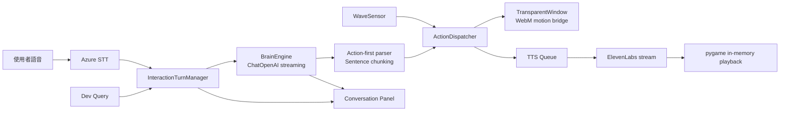

# ECHOES Virtual Pet

以 `PyQt5 + QWebEngine` 為外殼、`Azure STT` 為語音輸入、`OpenAI GPT-4o-mini` 為串流大腦、`ElevenLabs + pygame` 為記憶體語音播放、`WebM` 為角色動作載體的桌面虛擬寵物專案。

目前主線已完成：

- Azure STT 背景收音與開始 / 停止控制
- `InteractionTurnManager` 單輪互動序列化，避免上一輪還沒播完就插入下一輪
- `BrainEngine` 的 OpenAI 串流回覆、action-first prompt、句讀切塊、bounded message memory
- `ActionDispatcher` 的動作前置、TTS queue 與背景 worker 收尾
- `TransparentWindow + app.js` 的 WebM 動作切換、狀態列與 conversation panel
- `InteractionLatencyTracker` 的 STT / LLM / Action / TTS 延遲追蹤
- OpenCV `wave_response` 揮手感測

延伸架構文件：

- [現階段 ArchViz（Phase 1 / Phase 2）](/home/norlan/projecgt/Virtual-Pet/docs/current_stage_archviz.md)
- [執行緒 / Worker 拓樸圖](/hom
e/norlan/projecgt/Virtual-Pet/docs/thread_worker_topology.md)

## 架構概覽



目前系統的重點已不是單純的 `STT -> LLM -> TTS`，而是：

- 多輸入源整合
- 一輪一輪的互動序列化
- 動作與語句拆分後的低延遲回應
- UI 狀態、對話文字、語音播放的同步完成

## 目前目錄

```text
Virtual-Pet/
├── main.py
├── config.py
├── interaction_trace.py
├── interaction_turn_manager.py
├── action_dispatcher.py
├── action_services.py
├── character_library.py
├── api_client/
│   ├── brain_engine.py
│   ├── elevenlabs_client.py
│   └── comfyui_client.py
├── sensors/
│   ├── microphone_stt.py
│   ├── stt_session_controller.py
│   └── camera_vision.py
├── ui/
│   ├── transparent_window.py
│   ├── settings_dialog.py
│   └── web_container/
│       ├── index.html
│       ├── style.css
│       └── app.js
├── scripts/
│   ├── smoke_test.py
│   └── verify_linux_env.py
├── tests/
│   ├── test_action_playback.py
│   ├── test_brain_streaming.py
│   ├── test_elevenlabs_streaming.py
│   ├── test_interaction_turn_manager.py
│   ├── test_microphone_stt.py
│   ├── test_stt_controls_and_trace.py
│   └── test_wave_sensor.py
├── docs/
│   ├── current_stage_archviz.md
│   ├── thread_worker_topology.md
│   ├── linux_deployment.md
│   ├── STTTTS.md
│   └── archive/
├── legacy/
│   └── openclaw/
└── openspec/
```

## 核心模組

- `main.py`
  啟動 `QApplication`、`TransparentWindow`、`BrainEngine`、`InteractionTurnManager`、`STTSessionController`、`WaveSensor`，並管理整體關閉流程。

- `interaction_turn_manager.py`
  把 STT 與 Dev Query 序列化成一輪一輪互動。上一輪尚未完成時，下一輪只會排隊，不會插隊。

- `api_client/brain_engine.py`
  使用 `ChatOpenAI(model="gpt-4o-mini", streaming=True)`。以 message history 保存最近幾輪對話，避免使用已棄用的 classic memory；同時在背景執行緒預熱 active profile，並先解析最前面的 `[ACTION:tag]`，再依標點切出第一句與後續句子，讓 TTS 可以提早開始。

- `action_dispatcher.py`
  統一處理 action alias、白名單、WebM 動作切換、TTS queue 與背景 worker 收尾。

- `api_client/elevenlabs_client.py`
  以 `stream=True` 向 ElevenLabs 收音訊 byte stream，直接進 `BytesIO`，再由 `pygame` 從記憶體播放，不再寫入 `assets/temp_audio/`。

- `ui/transparent_window.py`
  管理透明桌面視窗與 Python -> JS bridge，負責狀態列、對話卡片、WebM 動作切換。

- `ui/web_container/app.js`
  控制 idle / temporary motion、conversation panel、queue depth 顯示與前端狀態更新。

- `interaction_trace.py`
  追蹤每一輪互動的 `brain_queue_wait`、`llm_to_first_output`、`tts_startup`、`tts_tail` 與 bottleneck。

## 互動流程

```text
使用者輸入
-> Azure STT finalized text
-> InteractionTurnManager
-> BrainEngine(OpenAI streaming)
-> [ACTION:*] 立即觸發 WebM
-> 第一個句讀片段送入 TTS queue
-> ElevenLabs stream -> pygame playback
-> 對話卡片完成
-> 下一輪開始
```

補充：

- `wave_response` 可直接走 `ActionDispatcher`，不需經過大腦與 TTS。
- STT 停止後的晚到辨識事件會被忽略，避免停止收音後又偷偷塞進新互動。
- 關閉程式時會先 shutdown 背景 worker，避免 `QThread: Destroyed while thread is still running`。

## Action 白名單

目前 Host 支援的 action：

- `report_news`
- `play_music`
- `wave_response`
- `laugh`
- `angry`
- `awkward`
- `speechless`
- `listen`
- `idle`

常見 alias 會自動正規化，例如：

- `news` -> `report_news`
- `music` -> `play_music`
- `happy` -> `laugh`
- `mad` -> `angry`
- `thinking` -> `listen`

## 資產規則

角色資產放在：

```text
assets/webm/characters/<character_id>/
├── manifest.json
├── source/
└── motions/
```

`manifest.json` 內的 `motions` 建議至少包含：

- `idle`
- `report_news`
- `play_music`
- `wave_response`
- `laugh`
- `angry`
- `awkward`
- `speechless`
- `listen`

缺少 action 專用 WebM 時，系統會安全退回 idle。

## 安裝

以下指令都假設在專案根目錄，並且先進入虛擬環境。

### 1. 建立並啟用虛擬環境

```bash
python -m venv venv
```

Linux / macOS：

```bash
source venv/bin/activate
```

Windows PowerShell：

```bash
.\venv\Scripts\Activate.ps1
```

### 2. 安裝依賴

```bash
pip install -r requirements.txt
```

### 3. 設定 `.env`

建議至少提供：

```bash
OPENAI_API_KEY=your_openai_api_key
OPENAI_MODEL=gpt-4o-mini
ELEVENLABS_API_KEY=your_elevenlabs_api_key
ELEVENLABS_VOICE_ID=your_voice_id
AZURE_STT_API_KEY=your_azure_speech_key
AZURE_STT_REGION=eastus
AZURE_STT_LANGUAGE=zh-TW
AZURE_STT_ENABLED=true
```

可選欄位：

```bash
ELEVENLABS_MODEL_ID=eleven_flash_v2_5
ELEVENLABS_SPEED=1.15
CHATGPT_API_KEY=your_openai_api_key_fallback
BRAIN_MEMORY_MAX_TURNS=6
OPENAI_TEMPERATURE=0.4
```

說明：

- `OPENAI_API_KEY` 是目前主線必填。
- `CHATGPT_API_KEY` 只作為 `OPENAI_API_KEY` 的 fallback。
- `BRAIN_MEMORY_MAX_TURNS` 用來限制保留的最近對話輪數，避免上下文無限制膨脹而拖慢延遲。
- 舊的 `OLLAMA_*` 設定仍留在 `config.py` 內做相容保留，但已不是目前互動主路徑。

## 啟動

```bash
python main.py
```

Linux 若遇到 Qt / WebEngine / WebGL 問題，請參考 [linux_deployment.md](/home/norlan/projecgt/Virtual-Pet/docs/linux_deployment.md)。

## 測試與驗證

### 單元測試

```bash
python -m unittest discover -s tests -v
```

目前測試涵蓋：

- action / motion / TTS queue 播放順序
- OpenAI 串流切片與安全降級
- ElevenLabs 記憶體播放
- interaction turn 排隊與完成順序
- STT 控制與延遲追蹤
- wave sensor 整合

### 冒煙測試

```bash
python scripts/smoke_test.py
```

用途：

- 檢查 `.env` 主要欄位
- 檢查 OpenAI 串流是否能產出 action-first 片段
- 檢查 ElevenLabs 串流是否能回傳有效音訊
- 先 warmup 1 輪，再量測 3 輪 latency probe，用中位數與 `fast_rounds` 檢查整體流程是否穩定

### 建議驗證流程

1. 先啟用 `venv`
2. 跑單元測試
3. 跑 `python scripts/smoke_test.py`
4. 啟動 `python main.py`
5. 點 `開始收音`，說一句短句，例如：`請先聽我說，再鼓勵我一句。`
6. 觀察是否依序出現：
   - STT finalized text
   - 新的 conversation turn
   - `[ACTION:listen]` 先觸發 WebM
   - 第一個句讀片段開始 TTS
   - 本輪完成後才進下一輪

### 延遲摘要判讀

每輪互動完成後，terminal 會輸出摘要，例如：

```text
[ECHOES][TRACE][abcd1234] 互動完成摘要 source=stt total=1870ms | stages: brain_queue_wait=0ms; llm_to_first_output=930ms; tts_startup=556ms; tts_tail=384ms | bottleneck=llm_to_first_output(930ms)
```

可快速判讀：

- `brain_queue_wait`: 進入腦引擎佇列後，真正開始處理前等待多久
- `llm_to_first_output`: OpenAI 從開始推論到第一個片段輸出的時間
- `tts_startup`: 第一段 TTS 進佇列到開始送入播放器的時間
- `tts_tail`: TTS 開始後到整輪完成還花了多久
- `bottleneck`: 這輪最慢的階段

`scripts/smoke_test.py` 則會另外輸出多輪摘要，例如：

```text
[PASS] LatencyProbe: 多輪量測通過。 totals=[1861, 2405, 1489]ms, median_total=1861ms, median_action=914ms, median_tts_start=1138ms, fast_rounds=2/3
```

可快速判讀：

- `median_total`: 3 輪量測的端到端中位數，用來抗單輪 jitter
- `fast_rounds`: 3 輪內有幾輪壓在 2000ms 內；目前 smoke 預設至少要 `2/3`

## 開發備註

- `legacy/openclaw/` 是封存區，不是目前主流程依賴。
- `docs/archive/` 存放歷史文件，不影響主流程。
- 若要理解目前程式真實結構，請優先看本 README 與 `docs/current_stage_archviz.md`，不要以舊提交內的 Ollama 流程為準。
