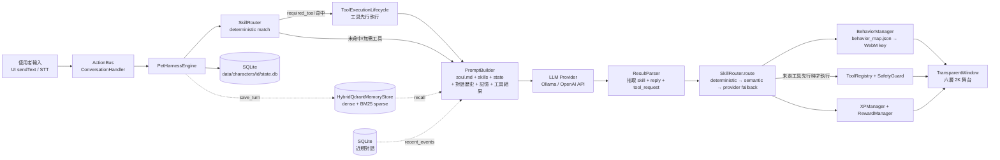
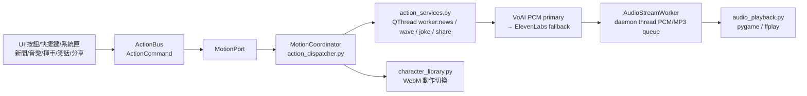

# ECHOES Virtual Pet

以 `PyQt5 + QWebEngineView` 為六層 2K 舞台外殼的桌面虛擬寵物專案。每個角色擁有獨立的 `PetHarnessEngine`(Skills / XP / Reward / Memory 全部隔離),`main.py` 是唯一的 composition root:組裝 `ApplicationCoordinator`(ActionBus / EventBus / RuntimeLifecycle)、`PyQtHarnessAdapter` 與 `TransparentWindow`。

| 項目 | 內容 |
|------|------|
| **對話大腦** | `PetHarnessEngine`(Ollama / OpenAI-compatible API),負責文字對話、skill 路由、工具呼叫、對話記憶、XP/獎勵、behavior→WebM 映射 |
| **統一動作入口** | `ActionBus`:對話、快捷按鈕、快捷鍵、系統匣、web overlay 全部收斂為 `ActionCommand`,同步回 `ActionResult`、副作用經 `AppEvent` 送回 Presentation |
| **本地快捷動作** | `ActionBus → Handler → MotionPort → MotionCoordinator`:動畫、TTS queue 與播放收尾狀態機,驅動「新聞播報/播放音樂/揮手回應/固定笑話/固定分享」 |
| **資產生成** | `pet_harness/asset/`:XP 升級或定時觸發成長 offer → 前端確認 → ComfyUI 生成角色變體圖/動作 WebM/背景,支援 active_variant 換裝 |
| **離線安全** | 對話大腦 Yes(Ollama 免 API key);快捷動作語音需 VoAI 或 ElevenLabs API key;資產生成需本機 ComfyUI 服務 |

參考文件(`docs/` 大部分被 gitignore,僅存在於工作機):

- [六層舞台架構 (Stage ArchViz)](docs/current_stage_archviz.md)
- [STT/TTS 運行狀態](docs/STTTTS.md)
- [ComfyUI 資產生成管線](docs/comfyui_pipeline.md)
- [Harness Agentic 控制面板](docs/current_test_ui_agentic_controls.md)
- [角色人設 (Personal)](docs/character_personal.md)
- [Linux 部署指南](docs/linux_deployment.md)

機台/新機轉移請看 **[MIGRATION.md](MIGRATION.md)**(git 有追蹤;因大量關鍵資產被 gitignore,轉移必須整包複製而非 clone)。

---

## 運行模式:外部依賴與降級行為

所有外部依賴都是**可降級**的——缺少任何一項,應用程式仍可啟動,對應功能自動關閉或退回替代實作:

| 功能 | 依賴 | 缺少時的行為 |
|------|------|--------------|
| 對話大腦 | Ollama(`localhost:11434`,免金鑰)或 OpenAI-compatible API | 兩者皆不可用時對話回 `EVT_RUNTIME_ERROR`,UI busy 復位,其他功能照常 |
| 快捷動作語音 | `VOAI_API_KEY`(primary)/ `ELEVENLABS_API_KEY`(fallback) | 動作照播但**靜音** |
| 語音輸入 STT | NVIDIA CUDA GPU + cuDNN + faster-whisper 模型 | STT 按鈕顯示「不可用」,文字輸入不受影響 |
| 新聞 / YouTube 工具 | Playwright Chromium + 網路 | 工具回傳可讀錯誤訊息,不影響對話 |
| 資產生成 | 本機 ComfyUI(`127.0.0.1:8188`) | 自動退回 `MockAssetService` |
| 對話記憶 | 嵌入式 Qdrant + fastembed | 檢索 fail-open 回空清單,絕不中斷對話 |
| 語意 skill 路由 | Qdrant + fastembed | 預設 shadow mode,只記錄候選不影響路由 |

### 啟動流程(檔案運行模式)

```text
run.bat ──▶ .venv\Scripts\python.exe main.py
             │
             ▼
main.py(唯一 composition root)
  1. 載入 .env(SecretMasker 遮罩)→ config.py 集中設定
  2. preload onnxruntime / STT 模型(失敗則 STT 標記不可用)
  3. 組裝 ApplicationCoordinator(ProviderRuntime / ActionBus / EventBus /
     RuntimeLifecycle / handlers / CharacterRouter+per-character engine)
  4. PyQtHarnessAdapter(PyQt ↔ engine 橋接)
  5. TransparentWindow 載入 ui/web_container/index.html(QWebEngineView,
     六層 2K 舞台;JsGateway 在 webview ready 前自動排隊 Python→JS 呼叫)
  6. aboutToQuit ──▶ RuntimeLifecycle.shutdown_all() 依註冊反序停止
     (STT → MotionCoordinator/Audio → adapter/Browser),逾時不阻塞退出
```

---

## 架構概覽

### 分層架構

```text
┌ Presentation(ui/…,可用 PyQt)────────────────────────────────────┐
│ TransparentWindow(視窗殼)  JsGateway(Python→JS 佇列橋)          │
│ CharacterUiBridge(QWebChannel)PresentationEventBinder            │
│ MotionCoordinator(動畫/TTS 播放收尾狀態機,action_dispatcher.py)  │
└──────── ActionCommand 提交 ↓ ──────── AppEvent 訂閱 ↑ ─────────────┘
┌ Application(pet_harness/app/,禁止 import PyQt)──────────────────┐
│ ApplicationCoordinator(唯一組裝入口) ActionBus + ActionHandlers   │
│ RuntimeLifecycle(集中啟停/shutdown) Ports(Conversation/          │
│ Motion/BackgroundExecutor)+ SecretMasker / ProviderConfigService  │
└──────── 呼叫 Domain ↓ ──────── Infrastructure 實作 Ports ↑ ────────┘
┌ Domain(pet_harness/engine|skills|xp|character|models,純 Python)─┐
│ PetHarnessEngine(Conversation Pipeline) SkillRouter XPManager …   │
└─────────────────────────────────────────────────────────────────────┘
┌ Infrastructure ─────────────────────────────────────────────────────┐
│ ProviderRuntime SQLiteStore HybridQdrantMemoryStore                 │
│ QtBackgroundExecutor VoAI/ElevenLabs TTS PlaywrightBrowserRuntime   │
│ ComfyUIClient + AssetJobWorker(資產生成)                           │
└─────────────────────────────────────────────────────────────────────┘
```

- 依賴方向只准往下;`tests/test_dependency_boundaries.py` 靜態掃描守門(Application/Domain 出現 `PyQt5` import 即 fail)。
- 對話流程:UI `sendText` → `ActionCommand("conversation")` → `ActionBus` → `ConversationHandler` → `QtBackgroundExecutor`(QThread 背景執行)→ `PyQtHarnessAdapter.run_turn` → `PetHarnessEngine.handle_event`;完成後以 `EVT_CONVERSATION_TURN` 事件回到 `PresentationEventBinder` 更新 UI、觸發動畫與 TTS。失敗走 `EVT_RUNTIME_ERROR`,UI busy 狀態一律復位。
- 快捷動作:按鈕/快捷鍵/系統匣 → `ActionCommand` → `ActionBus` → handler → `MotionPort` → `MotionCoordinator`(defer/duplicate/timeout 語意不變)。
- 關閉流程:`aboutToQuit` → `ApplicationCoordinator.shutdown()` → `RuntimeLifecycle.shutdown_all()` 依註冊反序停止(STT → MotionCoordinator/Audio → adapter/Browser),單一 runtime 逾時不阻塞退出。

### Harness 對話流程


```mermaid
flowchart LR
    USER[使用者輸入<br>UI sendText / STT] --> BUS[ActionBus<br>ConversationHandler] --> ENGINE[PetHarnessEngine]

    ENGINE --> ROUTE0[SkillRouter<br>deterministic match]
    ROUTE0 -- required_tool 命中 --> TOOLFIRST[ToolExecutionLifecycle<br>工具先行執行]
    TOOLFIRST --> PROMPT
    ROUTE0 -- 未命中/無需工具 --> PROMPT

    MEM[(HybridQdrantMemoryStore<br>dense + BM25 sparse)] -. recall .-> PROMPT
    HIST[(SQLite<br>近期對話)] -. recent_events .-> PROMPT

    PROMPT[PromptBuilder<br>soul.md + skills + state<br>+ 對話歷史 + 記憶 + 工具結果] --> LLM[LLM Provider<br>Ollama / OpenAI API]
    LLM --> PARSER[ResultParser<br>抽取 skill + reply + tool_request]

    PARSER --> ROUTER[SkillRouter.route<br>deterministic → semantic → provider fallback]
    ROUTER -- 未走工具先行時才執行 --> TOOLS[ToolRegistry + SafetyGuard]
    ROUTER --> BEHAVIOR[BehaviorManager<br>behavior_map.json → WebM key]
    ROUTER --> XP[XPManager + RewardManager]

    BEHAVIOR --> UI[TransparentWindow<br>六層 2K 舞台]
    TOOLS --> UI
    XP --> UI
    ENGINE --> DB[(SQLite<br>data/characters/id/state.db)]
    ENGINE -. save_turn .-> MEM
```

- **工具先行**:deterministic 命中且 skill 帶 `required_tool` 時(例如新聞、YouTube 音樂),先執行工具取得真實資料,再把 `ToolResult` 餵給 LLM 合成回覆——LLM 呼叫仍是一次,只是換了順序,避免回覆引用上一輪殘留的工具結果。
- **對話記憶**:短期記憶是近 6 輪 `SQLite` 對話歷史;長期記憶是 per-character 的 `HybridQdrantMemoryStore`(本地嵌入式向量庫,dense 向量 + jieba BM25 sparse 混合檢索),檢索前先經 `QueryRewriter` 做上下文查詢改寫,記憶寫入由 `MemoryExtractor`(LLM 抽取)判定資格。任何一方未就緒或故障都 fail-open(不中斷對話)。
- **語音輸入(STT)**:`sensors/stt_controller.py` 是 `UI sendText` 之外的第二個輸入來源——切換式錄音停止後,有效 transcript 會呼叫既有的 `TransparentWindow.submit_agentic_text()`,走與打字輸入完全相同的下游流程。

### 本地快捷動作子系統(與 Harness 大腦並行運作)


```mermaid
flowchart LR
    UI[UI 按鈕/快捷鍵/系統匣<br>新聞/音樂/揮手/笑話/分享] --> BUS[ActionBus<br>ActionCommand]
    BUS --> PORT[MotionPort]
    PORT --> DISP[MotionCoordinator<br>action_dispatcher.py]
    DISP --> SVC[action_services.py<br>QThread worker:news / wave / joke / share]
    SVC --> TTS[VoAI PCM primary<br>→ ElevenLabs fallback]
    TTS --> AW[AudioStreamWorker<br>daemon thread PCM/MP3 queue]
    AW --> PLAY[audio_playback.py<br>pygame / ffplay]
    DISP --> MOTION[character_library.py<br>WebM 動作切換]
```

> 此子系統完全獨立於 `PetHarnessEngine`。`report_news`/`play_music`/`wave_response` 走固定腳本+快取音檔;`cached_joke`/`cached_share` 首次觸發時會呼叫 LLM 產生文字後寫入快取,之後皆直接讀快取。

### ComfyUI 資產生成與變體生命週期


```mermaid
flowchart LR
    TRIG[GrowthTriggerService<br>XP 升級 / 定時觸發] --> OFFER[asset_pending_offer<br>持久化至 state.db]
    OFFER --> HUD[前端 HUD 輪詢<br>升級確認 modal]
    HUD -- 確認 --> SVC[CharacterUiService<br>confirm_growth_offer]
    SVC --> ORCH[AssetOrchestrator<br>WorkflowPatcher patch ComfyUI_Json/*.json]
    ORCH --> CLIENT[ComfyUIClient<br>HTTP/WS 127.0.0.1:8188]
    CLIENT --> WORKER[AssetJobWorker<br>背景佇列 + 啟動時 recover]
    WORKER --> OUT[images/&lt;variant&gt;/ PNG<br>motions/&lt;variant&gt;/*.webm<br>images/bg/&lt;variant&gt;.png]
    OUT --> STYLE[Style Menu<br>list_style_variants / apply_style]
    STYLE --> ACTIVE[manifest active_variant<br>換裝 + 背景同步切換]
```

- 觸發與生成**拆離**:升級/定時只產生 offer(寫入 `asset_pending_offer`,含 TTL 過期機制 `PREVIEW_OFFER_TTL_HOURS`,預設 24h),前端確認後才排入生成;拒絕即清除,不重複跳框。
- 變體三態判準:僅有 PNG = `generating`、有 `motions/<variant>/idle.webm` = `ready`、offer 待確認 = `awaiting_confirm`。
- `active_variant` 寫在 manifest,`get_motion_path` 依 `motions/<active_variant>/<key>.webm` 優先解析、舊扁平表次之、og fallback;Apply 後角色 idle 影片與背景同步重載。
- ComfyUI 不可用時 `pet_harness/asset/factory.py` 自動退回 `MockAssetService`(`COMFYUI_ENABLED=false` 亦同),不影響其他功能。

---

## Per-character 隔離

每個角色各自擁有:

- `PetHarnessEngine` instance(含自己的 `SkillRouter`、`ToolRegistry`)
- `data/characters/{character_id}/state.db` — SQLite 狀態(事件、XP、工具紀錄、記憶項、資產 job)
- `data/characters/{character_id}/qdrant/` — 對話記憶向量庫(與 skill 語意路由共用的 `runtime_cache/qdrant` 實體隔離,避免嵌入式 Qdrant 的檔案鎖衝突)
- `data/characters/{character_id}/profile.json`、`personal.json` — persona、技能授權、別名/優先度覆寫

角色切換由 `CharacterRouter.switch_character()` 原子性地替換整組 engine/profile/snapshot,不會出現分裂狀態。

---

## 目錄結構與檔案說明

```text
Virtual-Pet/
├── main.py                         # 應用程式進入點=composition root(preload onnx/STT → 組裝 coordinator/adapter/window/lifecycle)
├── config.py                       # 集中式設定中心(.env 讀取 + persona + action 白名單 + TTS/STT/ComfyUI/語意路由參數)
├── character_library.py            # 角色資產庫:manifest 讀取、active_variant、motion 路徑解析、變體庫存(快捷動作+Harness 共用)
├── interaction_trace.py            # 每回合 STT→LLM→TTS 分段延遲追蹤
├── action_dispatcher.py            # MotionCoordinator:action 白名單/alias 正規化、WebM 動作切換、TTS queue 與播放收尾狀態機
├── action_services.py              # 快捷動作背景 QThread worker(新聞/揮手/固定意圖快取,文字生成走 LangChain ChatOpenAI)
├── text_utils.py                   # sanitize_tts_text:去除 ACTION 標記供 TTS 朗讀
├── audio_playback.py               # 快捷動作用 provider-neutral 播放器(ffplay / pygame)
├── audio_worker.py                 # trace-aware PCM/MP3 串流播放 worker(daemon thread,producer-consumer 佇列)
│
├── sensors/                        # 語音輸入(STT)
│   ├── base_stt.py                 # BaseSTT ABC + TranscriptionResult(provider 可替換契約)
│   ├── faster_whisper_stt.py       # FasterWhisperSTT:CUDA-only 模型生命週期與轉錄(含 Windows CUDA DLL PATH 註冊)
│   ├── microphone_recorder.py      # sounddevice InputStream 收音(mono/16kHz/float32 buffer)
│   ├── silero_vad.py               # Silero VAD 語音端點偵測(可選,STT_VAD_ENABLED)
│   └── stt_controller.py           # SttController:錄音 session 狀態機、背景 worker、一次性提交
│
├── api_client/                     # TTS clients
│   ├── adaptive_tts_fallback.py    # VoAI primary + ElevenLabs fallback 統一 contract
│   ├── voai_client.py              # VoAI HTTP PCM 串流 TTS client
│   └── elevenlabs_client.py        # ElevenLabs fast-fallback TTS client
│
├── pet_harness/                    # ★ Harness 模式核心引擎
│   ├── app/                        # ★ Application 層(禁止 import PyQt)
│   │   ├── application_coordinator.py  # 唯一組裝入口:ProviderRuntime/Router/ActionBus/handlers
│   │   ├── action_bus.py           # ActionCommand → handler 路由;unknown→rejected、例外隔離
│   │   ├── action_handler.py       # ActionHandler ABC
│   │   ├── commands.py / results.py / events.py  # ActionCommand / ActionResult / AppEvent dataclass
│   │   ├── event_bus.py            # EventBus + SimpleEventBus
│   │   ├── handlers.py             # conversation / news / music / wave / quick_intent / speak / motion_only / reset handlers
│   │   ├── ports.py                # ConversationPort / MotionPort / BackgroundExecutor(ABC)
│   │   ├── runtime_lifecycle.py    # ManagedRuntime + RuntimeLifecycle(反序 shutdown)+ CallbackRuntime
│   │   ├── provider_config_service.py  # Provider 設定/bootstrap(local-first Ollama)
│   │   └── secret_masking.py       # .env 載入 + 遞迴 secret 遮罩
│   ├── engine/
│   │   ├── harness_engine.py       # 中央協調器:event →(工具先行)→ 記憶檢索 → prompt → LLM → parse → route → XP → DB
│   │   ├── tool_execution_lifecycle.py  # 工具執行閉環(安全授權/重試/預算/落庫)
│   │   └── media_session_context.py     # 新聞/音樂 session 上下文(per-character)
│   ├── agent/
│   │   ├── provider_factory.py     # LLM provider 工廠(Ollama / API)
│   │   ├── provider_adapter.py     # LLMProviderAdapter 抽象介面 + ProviderReply
│   │   ├── ollama_provider.py      # Ollama 本地推論 provider
│   │   ├── api_provider.py         # OpenAI-compatible REST provider
│   │   ├── prompt_builder.py       # Prompt 組裝(soul.md + agentic.md + skills + state + 對話歷史 + 記憶 + 工具結果)
│   │   └── result_parser.py        # LLM 回覆結構化解析(skill / reply / tool_request)
│   ├── asset/                      # ★ ComfyUI 資產生成管線
│   │   ├── factory.py              # 依 COMFYUI_ENABLED + health check 選 ComfyUIAssetService 或 MockAssetService
│   │   ├── service.py / asset_contract.py / asset_models.py  # AssetService 介面、AssetRequest/Response、GrowthOffer
│   │   ├── asset_orchestrator.py   # 生成 job 編排(character validation → image → motion → background)
│   │   ├── workflow_patcher.py     # patch ComfyUI_Json/*.json workflow(注入 prompt/圖/輸出路徑)
│   │   ├── comfyui_client.py       # ComfyUI HTTP/WS client(127.0.0.1:8188)
│   │   ├── asset_job_worker.py     # 背景 job 佇列 + 啟動時中斷復原
│   │   ├── asset_repository.py     # 資產 job SQLite 持久層
│   │   ├── growth_trigger.py       # XP 升級/定時觸發 → 產生 GrowthOffer(去重、pending 短路)
│   │   ├── comfyui_asset_service.py / mock_asset_service.py  # 正式/離線實作
│   ├── memory/                     # ★ 對話記憶(hybrid 檢索)
│   │   ├── base_memory_store.py    # BaseMemoryStore ABC + NullMemoryStore(headless/測試零開銷預設)
│   │   ├── hybrid_qdrant_memory_store.py  # per-character 嵌入式 Qdrant(dense + sparse 混合,背景寫入、fail-open 檢索)
│   │   ├── base_hybrid_index.py    # 混合索引介面
│   │   ├── memory_extractor.py     # LLM 記憶抽取(判定哪些對話值得長期記憶)
│   │   ├── memory_item_repository.py  # SQLite memory_items 持久層
│   │   ├── contextual_memory_retriever.py  # 檢索編排(rewrite → hybrid search → policy)
│   │   ├── query_rewriter.py       # 上下文查詢改寫(代名詞/省略補全)
│   │   ├── sparse_encoder.py       # jieba + BM25 sparse 向量編碼
│   │   ├── result_policy.py        # 檢索結果過濾/去重策略
│   │   └── memory_models.py        # MemoryItem 等 dataclass
│   ├── character/
│   │   ├── profile.py              # CharacterProfile(sqlite_path / qdrant_collection 等)
│   │   ├── personal.py             # personal.json + local skills 驗證式讀寫
│   │   ├── registry.py             # CharacterRegistry(載入/建立/刪除角色)
│   │   ├── router.py               # CharacterRouter(角色切換中樞,持有 active engine)
│   │   ├── customization_service.py # persona / local skill / 內建 skill 別名覆寫的驗證式讀寫
│   │   └── exceptions.py           # 角色領域例外
│   ├── behavior/behavior_manager.py # Skill → behavior_id / WebM key 映射
│   ├── models/                     # 純 dataclass:events / agent_result / provider / skill / reward
│   ├── skills/
│   │   ├── skill_loader.py         # 從 .agentic/skills/*.md 讀取 Skill 定義(含 skills-lock.json)
│   │   ├── skill_router.py         # deterministic → semantic → provider fallback 路由
│   │   ├── semantic_skill_retriever.py # Qdrant + fastembed 語意路由(shadow mode 預設開)
│   │   └── intent_normalizer.py    # 輸入意圖正規化
│   ├── storage/
│   │   ├── sqlite_store.py         # SQLite 持久層(XP / events / tool results / settings / memory_items / asset jobs)
│   │   └── schema.sql              # DB schema 定義
│   ├── tools/
│   │   ├── registry.py             # Tool 註冊表(靜態註冊內建工具)
│   │   ├── safety_guard.py         # Tool 執行安全閘門(RiskLevel / ExecutionClass)
│   │   ├── network_policy.py       # 工具網路存取政策
│   │   ├── web_article_tool.py     # 巴哈 GNN 今日新聞(RSS → HTTP → Playwright 三層 fallback)
│   │   ├── article_fetchers.py                 # 文章擷取實作
│   │   ├── youtube_music_tool.py   # YouTube 播放(Playwright 持久化 context)
│   │   └── tool_models.py          # ToolRequest / ToolResult dataclass
│   ├── runtime/
│   │   ├── provider_runtime.py     # 全域 LLM Provider 設定/健康狀態持有者(可熱切換)
│   │   ├── qt_background_executor.py  # BackgroundExecutor 的 Qt 實作(QThread + queued 回呼到 UI 執行緒)
│   │   ├── playwright_browser_runtime.py  # 持久化 Chromium context(cookie 跨啟動保留,降低反自動化 403)
│   │   ├── base_browser_runtime.py / browser_worker.py / browser_session_manager.py
│   ├── xp/
│   │   ├── xp_manager.py           # XP 經驗值結算(per-skill + per-user)
│   │   └── reward_manager.py       # 獎勵解鎖檢查(reward_rules.json)
│   ├── ui/
│   │   ├── pyqt_harness_adapter.py # PyQt ↔ Harness Engine 橋接層(provider 狀態、skills CRUD、前端 payload)
│   │   └── character_ui_service.py # 角色 CRUD / persona 面板 / 成長 offer 確認 / 造型變體(list_style_variants、apply_style)
│   └── voice_runtime_status_adapter.py  # STT 狀態 → 前端 DTO
│
├── ui/
│   ├── transparent_window.py       # 透明桌面視窗 + QWebChannel bridge(adapter/dispatcher 由 main.py 注入)
│   ├── js_gateway.py               # Python→JS 呼叫佇列橋(webview ready 前自動排隊)
│   ├── character_ui_bridge.py      # QWebChannel bridge(listStyleVariants / applyStyle / confirmGrowthOffer 等)
│   ├── presentation_wiring.py      # MotionPortAdapter + PresentationEventBinder(AppEvent → window UI)
│   ├── background_resolver.py      # 背景圖三級 fallback 解析(含 variant 背景)
│   ├── settings_dialog.py          # 設定對話框(角色圖上傳 + ComfyUI 驗證)
│   └── web_container/
│       ├── index.html              # 六層 2K 舞台 HTML(Skills / Persona / Style / Scene 面板 + 升級確認 modal)
│       ├── style.css               # 舞台 CSS(2560×1440 設計空間;實機為 Chromium 83,不可用 inset / flex gap)
│       └── app.js                  # 前端控制(idle/motion/conversation/agentic panel/HUD 輪詢)
│
├── assets/webm/characters/         # 角色資產(manifest.json + motions/ + images/;gitignore)
├── .agentic/                       # Harness 人格與技能定義(soul.md / behavior_map.json / reward_rules.json / skills/*.md)
├── data/characters/{id}/           # per-character 狀態:state.db、qdrant/、profile.json、personal.json
├── runtime_cache/                  # 執行期快取(news_audio / wave_audio / fixed_intents / qdrant 語意路由索引 / whisper 模型)
├── ComfyUI_Json/                   # ComfyUI workflow 模板(gitignore;被 asset/factory.py 與測試引用)
├── scripts/                        # CLI 除錯與驗證工具(見下方「測試與驗證」)
├── tests/                          # pytest 測試(~82 檔,見下方「測試與驗證」)
├── docs/                           # 架構與部署文件(大部分 gitignore)
├── openspec/                       # OpenSpec 變更管理(gitignore)
└── requirements.txt
```

---

## Harness 引擎核心模組

### PetHarnessEngine (`pet_harness/engine/harness_engine.py`)

中央協調器。接收 `UserEvent`,依序執行:

1. **SkillRouter.match** — 對輸入文字做 deterministic 關鍵字比對
2. **工具先行**(若命中的 skill 帶 `required_tool`)— 先執行 `ToolExecutionLifecycle`,取得真實 `ToolResult`
3. **記憶檢索** — `QueryRewriter` 上下文改寫 → `HybridQdrantMemoryStore` dense+sparse 混合檢索
4. **PromptBuilder** — 組裝 `soul.md` + `agentic.md` + 已載入 skills + state snapshot + 近期對話歷史 + 記憶命中 + 工具結果
5. **LLM Provider** — 送給選定的 LLM(Ollama / OpenAI-compatible API)
6. **ResultParser** — 從回覆中抽取結構化結果(matched skill / reply / tool_request / confidence)
7. **SkillRouter.route** — deterministic → semantic(Qdrant shadow mode)→ provider 建議 → none
8. **BehaviorManager** — 依 matched skill 查 `behavior_map.json`,決定 behavior_id 與 WebM key
9. **ToolRegistry + SafetyGuard** — 若未走工具先行且仍需要工具,過安全閘門後執行
10. **XPManager + RewardManager** — 結算經驗值,檢查獎勵解鎖;升級時經 `GrowthTriggerService` 產生資產生成 offer
11. **SQLiteStore + MemoryExtractor** — 落庫事件,背景抽取並寫入本輪對話記憶

最終組合為 `PetEvent` 回傳給 UI 層。

### 對話記憶 (`pet_harness/memory/`)

- `BaseMemoryStore`(ABC)定義 `save_turn` / `recall` / `status`;呼叫端只依賴介面。`NullMemoryStore` 是 headless/測試環境的零開銷預設。
- `HybridQdrantMemoryStore` 是正式實作:本地嵌入式 Qdrant,dense 向量(fastembed)+ jieba BM25 sparse 混合檢索;寫入在背景執行緒完成,檢索 fail-open(未就緒或例外一律回空清單,絕不中斷對話)。
- 記憶寫入走 `MemoryExtractor`(LLM 判定資格)→ `MemoryItemRepository`(SQLite)→ 背景索引至 Qdrant;`scripts/backfill_memory_items.py` 可將既有 SQLite 記憶回填至向量庫。
- `memory_store_factory` 與 `semantic_index_enabled` 由 composition root(`main.py`)注入——桌面 App 注入 Qdrant factory,headless/測試預設 `NullMemoryStore`,Domain 層完全不 import PyQt。

### LLM Provider 層 (`pet_harness/agent/` + `runtime/provider_runtime.py`)

| Provider | 用途 | 需要網路 |
|----------|------|----------|
| `OllamaProvider` | 本地 Ollama 推論 | No(localhost) |
| `APIProvider` | OpenAI-compatible REST API | Yes |

透過 `provider_factory.py` 依 `ProviderConfig.provider_type` 分派;全域 `ProviderRuntime` 是唯一持有者(自身即 `LLMProviderAdapter`,支援執行期熱切換),角色切換不影響 Provider 選擇。

### Skill 系統 (`pet_harness/skills/`)

技能定義放在 `.agentic/skills/*.md`,使用 frontmatter 描述觸發關鍵字、XP 獎勵、`required_tool`、`tool_policy` 等。`SkillLoader` 在引擎初始化時掃描載入,`SkillRouter` 依 deterministic → semantic(Qdrant,預設 shadow mode 只記錄不生效)→ provider 建議的順序路由。

目前內建技能:`bahamut_daily_news`、`gacha_fortune`、`game_news`、`music_bgm`、`youtube_music_playback`。

### Tool 系統 (`pet_harness/tools/`)

所有工具執行前都會通過 `SafetyGuard` 檢查 `ToolRiskLevel` 與 `ToolExecutionClass`,網路存取另受 `network_policy.py` 約束。媒體類工具(`web_article_tool`、`youtube_music_tool`)走 `PlaywrightBrowserRuntime` 的持久化 Chromium context。

### XP / 獎勵系統 (`pet_harness/xp/`)

- 每次互動自動結算 XP(matched skill 的 `xp_reward` 或預設 `chat_xp=2`)
- 工具成功執行額外獎勵;`RewardManager` 依 XP 總量檢查 `reward_rules.json` 的解鎖條件
- XP 升級會觸發 `GrowthTriggerService` 產生角色成長(變體生成)offer

---

## 六層 2K 舞台模型

UI 固定以 `2560×1440` 設計空間、`min(vw/2560, vh/1440)` 縮放渲染:

| 層級 | 用途 |
|------|------|
| 1. `stage-background` | 角色/變體專屬背景圖(`BackgroundResolver` 三級 fallback) |
| 2. `stage-pet-layer` | 角色 WebM 動作播放 |
| 3. `stage-live-ui` | 即時 UI(conversation panel、狀態列) |
| 4. `stage-bottom-ui` | 底部控制列 |
| 5. `stage-agentic-panel` | Companion Dock(Skills / Persona / Style / Scene) |
| 6. Browser overlays | 瀏覽器原生覆蓋層 |

角色使用 CSS design token 定位(`--pet-anchor-x`、`--pet-floor-y`),底部置中錨定以確保 agentic panel 滑入時角色不偏移。

> ⚠️ 實機為 QtWebEngine 5.15(Chromium 83):**不支援 CSS `inset` 與 flex `gap`**,前端改動需以實機驗證,Playwright(新版 Chromium)驗不出這類相容性問題。

### Companion Dock 面板職責分離

| 面板 | 內容 |
|------|------|
| **Skills** (`dock-panel-agent`) | 技能清單(啟用/停用/立即執行)、內建技能別名/優先度覆寫、角色專屬 local skill CRUD、命中預覽 |
| **Persona** (`dock-panel-persona`) | 角色人設文字編輯(儲存/取消) |
| **Style** (`dock-panel-style`) | 造型變體格子(og / development / event…):三態顯示(generating / awaiting_confirm / ready)、Apply 換裝 |
| **Scene** (`dock-panel-scene`) | 場景版位(背景與房間流程) |

Skills 與 Persona 共用同一份 `getCustomization()` 後端資料;Style 面板由 HUD 輪詢 `listStyleVariants` 取得真實變體庫存,偵測到 pending offer 時彈出升級確認 modal。

---

## Action 白名單

Host 支援的 action(Harness 對話與快捷動作共用同一份白名單):

`report_news` · `play_music` · `wave_response` · `laugh` · `angry` · `awkward` · `speechless` · `listen` · `idle`

常見 alias 自動正規化(`news` → `report_news`、`happy` → `laugh`、`music` → `play_music` 等)。

---

## 安裝

### 1. 建立並啟用虛擬環境

專案慣例使用 `.venv`(`run.bat` 直接呼叫 `.venv\Scripts\python.exe`):

```bash
python -m venv .venv
```

Windows PowerShell:
```powershell
.\.venv\Scripts\Activate.ps1
```

Linux / macOS:
```bash
source .venv/bin/activate
```

### 2. 安裝依賴

```bash
pip install -r requirements.txt
playwright install chromium
```

`playwright install chromium` 是使用 YouTube 播放與巴哈 GNN 今日新聞的必要步驟;若缺少 Chromium,工具會回傳可讀取的錯誤而不影響其他功能。

### 3. 設定 `.env`

**對話大腦最小設定(離線可用):**

不需要任何 API key,預設走 Ollama(`OLLAMA_BASE_URL=http://localhost:11434`)。若要接 OpenAI-compatible API:

```bash
OPENAI_API_KEY=your_openai_api_key
OPENAI_MODEL=gpt-4o-mini
```

**本地快捷動作子系統(需要 TTS API key 才有語音,沒有也能跑,只是動作靜音):**

```bash
VOAI_API_KEY=your_voai_api_key
ELEVENLABS_API_KEY=your_elevenlabs_api_key
```

**資產生成(可選,需本機 ComfyUI):**

```bash
COMFYUI_ENABLED=true
COMFYUI_BASE_URL=http://127.0.0.1:8188
```

ComfyUI 未啟動或 `COMFYUI_ENABLED=false` 時自動退回 `MockAssetService`,其他功能不受影響。

**語音輸入(STT,faster-whisper,需要 NVIDIA CUDA GPU):**

點擊 STT 按鈕開始/停止錄音,停止後在背景以 [faster-whisper](https://github.com/SYSTRAN/faster-whisper) 辨識(支援中文、英文、中英混說,自動偵測語言)。沒有 CUDA/cuDNN 或麥克風也能正常使用文字輸入,STT 按鈕會顯示「STT 不可用」。

CUDA/cuDNN 需求:僅支援 `STT_DEVICE=cuda`(無 CPU fallback)。Windows 上 `FasterWhisperSTT.setup()` 已自動把 pip 安裝的 `nvidia-cublas-cu12`/`nvidia-cudnn-cu12`/`nvidia-cuda-nvrtc-cu12` wheel 的 `bin/` 目錄前置進 `PATH`,通常不需手動設定;找不到 DLL 時 `setup()` 失敗、STT 按鈕維持 unavailable,不影響文字輸入。

`STT_*` 環境變數(皆有預設值,通常不需設定):

| 變數 | 預設值 | 說明 |
|---|---|---|
| `STT_ENABLED` | `true` | 總開關;設為 `false` 完全不建立任何 STT 物件 |
| `STT_MODEL` | `large-v3-turbo` | faster-whisper 模型名稱 |
| `STT_DEVICE` | `cuda` | 僅支援 `cuda`,無 CPU fallback |
| `STT_COMPUTE_TYPE` | `float16` | ctranslate2 計算精度 |
| `STT_MODEL_PATH` | `runtime_cache/whisper` | 模型下載/快取目錄,首次啟動下載後可離線重用 |
| `STT_LANGUAGE` | (空=自動偵測) | 設為 `zh`/`en` 可固定語言 |
| `STT_BEAM_SIZE` | `1` | beam search 寬度 |
| `STT_SAMPLE_RATE` | `16000` | 錄音取樣率(Hz) |
| `STT_MIN_RECORDING_MS` | `300` | 低於此長度視為過短,丟棄不辨識 |
| `STT_MAX_RECORDING_SECONDS` | `30` | 單次錄音上限,超過自動停止收音 |

STT VAD(語音端點自動停止,預設關閉):

| 設定 | 預設值 | 用途 |
|---|---:|---|
| `STT_VAD_ENABLED` | `false` | 設為 `true` 後,偵測到 Speech Endpoint 自動停止錄音;推論失敗仍可手動停止 |
| `STT_VAD_SILENCE_MS` | `800` | Speech Start 後連續靜音多久結束 session |
| `STT_VAD_THRESHOLD` | `0.5` | Silero 語音機率門檻 |

<details>
<summary>可選環境變數</summary>

```bash
VOAI_PCM_STREAMING_ENABLED=true
ELEVENLABS_VOICE_ID=default_elevenlabs_voice_id
ACTION_SYNC_TIMEOUT_MS=6000

# 資產生成 offer TTL(小時)
PREVIEW_OFFER_TTL_HOURS=24

# 語意 skill 路由(預設 shadow mode,只記錄候選不生效)
SEMANTIC_ROUTING_ENABLED=true
SEMANTIC_ROUTING_SHADOW_MODE=true
SEMANTIC_ROUTING_MODEL=sentence-transformers/paraphrase-multilingual-MiniLM-L12-v2
SEMANTIC_ROUTING_TOP_K=3
SEMANTIC_ROUTING_ACCEPT_THRESHOLD=0.60
SEMANTIC_ROUTING_MARGIN_THRESHOLD=0.08
QDRANT_MODE=local
QDRANT_PATH=runtime_cache/qdrant

# provider fallback
PROVIDER_ROUTING_FALLBACK_ENABLED=true
PROVIDER_ROUTING_CONFIDENCE_THRESHOLD=0.7

# 瀏覽器 session 復原
BROWSER_SESSION_RECOVERY_ENABLED=true
BROWSER_SESSION_RECOVERY_MAX_RETRIES=1
```

- `VOAI_PCM_STREAMING_ENABLED=false` 可回退到 MP3 BytesIO 播放
- `ACTION_SYNC_TIMEOUT_MS` 預設 `6000`,降低正常 VoAI 起播被誤判成 `timeout_promoted` 的機率
- 對話記憶沿用 `QDRANT_MODE`/`SEMANTIC_ROUTING_MODEL` 設定,但走獨立的 per-character 路徑(`data/characters/{id}/qdrant/`),不會與語意路由索引互相鎖檔

</details>

---

## 啟動

```bash
run.bat            # Windows,直接用 .venv 的 python
# 或
python main.py
```

Linux 若遇到 Qt / WebEngine / WebGL 問題,請參考 [linux_deployment.md](docs/linux_deployment.md)。

---

## 測試與驗證

### 測試哲學

- **產品碼無 mock、測試一律注入 fake adapter**:`tests/conftest.py` 提供 `FakeProvider`(deterministic 假 LLM);`tests/fakes/` 有 `FakeBrowserRuntime`(記錄 browser command 不開瀏覽器)、`FakeSemanticRetriever`、`FakeBackgroundExecutor`(同步執行免執行緒)。
- **不需要** 真 QApplication/QWebEngineView(UI 測試用 unbound method + MagicMock)、GPU/CUDA、Whisper/Silero 模型下載、網路——全部以假物件驗證。
- **characterization tests** 鎖定既有行為(動作派發、motion 清理、關機順序),防止重構時行為漂移;`tests/test_dependency_boundaries.py` 是架構守門(Application/Domain import PyQt 即 fail);`tests/test_workflow_secret_scan.py` 掃描 ComfyUI workflow 模板不得內嵌 API key。

### 執行方式

```bash
# 全跑(未裝 playwright / 未設 COMFYUI_SMOKE 時,相關測試自動 skip)
.venv/Scripts/python -m pytest -q

# 只跑快的單元測試(排除會啟動真 Chromium 的 browser 測試)
.venv/Scripts/python -m pytest -q --ignore=tests/test_cac_ui_browser.py

# 跑特定主題
.venv/Scripts/python -m pytest tests/test_character_*.py          # 角色系統
.venv/Scripts/python -m pytest -k "memory or hybrid or retriev"   # 記憶/檢索
.venv/Scripts/python -m pytest -k "stt or whisper or vad"         # STT

# ComfyUI smoke(需 ComfyUI 服務在 127.0.0.1:8188 執行)
COMFYUI_SMOKE=1 .venv/Scripts/python -m pytest tests/test_comfyui_smoke.py
```

### 測試分群(~82 檔)

| 主題 | 代表檔案 | 驗證邏輯 |
|---|---|---|
| **角色系統**(~17 檔) | `test_character_library/_registry/_router/_profile/_personal/_switch_integration/_ui_service/_validation_flow`、`test_growth_trigger`、`test_harness_per_character` | 角色建檔/驗證/語音對應、路由與切換原子性、per-character 狀態隔離、變體庫存三態與成長 offer 流程 |
| **記憶/檢索**(~14 檔) | `test_memory_extractor(+scenarios)/_item_repository`、`test_hybrid_memory_store/_store_startup`、`test_contextual_memory_retriever`、`test_contextual_query_rewrite`、`test_sparse_encoder`、`test_conversation_history_injection` | 記憶抽取資格判定、SQLite+Qdrant 混合索引(dense+BM25)、查詢改寫、歷史注入 prompt;Qdrant client 以假物件注入 |
| **asset / ComfyUI**(~7 檔) | `test_comfyui_smoke`、`test_asset_factory/_job_recovery/_repository_schema`、`test_workflow_patcher`、`test_workflow_secret_scan` | client 健康檢查/watch 協定(fake websocket)、workflow patch 與密鑰掃描、job 中斷復原 |
| **UI / browser**(~9 檔) | `test_cac_ui_browser`、`test_cac_ui_contract`、`test_js_gateway`、`test_browser_recovery`、`test_transparent_window_stt_states`、`test_presentation_wiring` | Web 容器 UI 互動接縫(真 Chromium 驗 CAC UX)、QWebChannel/JS gateway 契約、browser runtime 復原 |
| **STT / audio**(~10 檔) | `test_faster_whisper_stt`、`test_silero_vad`、`test_microphone_recorder`、`test_stt_controller/_toggle_integration`、`test_audio_playback`、`test_tts_runtime_mode` | Whisper/VAD/錄音以 monkeypatch 假模型驗(含 Windows CUDA DLL 註冊邏輯)、STT 狀態機、TTS 模式與快速失敗分類 |
| **agent / provider**(~12 檔) | `test_provider_bootstrap/_runtime`、`test_prompt_builder`、`test_result_parser_contract/_fenced_json`、`test_skill_router`、`test_semantic_routing`、`test_hostile_provider_interaction`、`test_conversation_pipeline_regression` | provider 設定/健康狀態、prompt 組裝、回覆解析契約與惡意輸出防禦、技能路由、對話 pipeline 回歸與 rollback |
| **dispatch / characterization**(~6 檔) | `test_action_dispatch_characterization`、`test_motion_coordinator_cleanup_characterization`、`test_shutdown_order_characterization`、`test_legacy_inventory` | 鎖定動作派發入口、motion 清理、關機順序既有行為;legacy 程式碼清單守門 |
| **架構/基礎**(~7 檔) | `test_composition_root_smoke`、`test_dependency_boundaries`、`test_runtime_lifecycle`、`test_action_bus`、`test_qt_background_executor` | 組合根可建構、依賴邊界、生命週期反序 shutdown、事件匯流排 |

### 特殊環境需求

| 測試 | 需求 | skip 機制 |
|---|---|---|
| `test_comfyui_smoke.py`(僅第 1 個 test) | 執行中的 ComfyUI 服務 | `skipif(os.getenv("COMFYUI_SMOKE") != "1")`;同檔其餘測試用假 websocket 照跑 |
| `test_cac_ui_browser.py` | Playwright + Chromium(會啟動 headless 瀏覽器) | `importorskip("playwright.sync_api")` |
| `test_character_validation_flow.py`(1 test) | unidecode 套件 | `importorskip("unidecode")` |
| `test_sparse_encoder.py` | subprocess 跑真 jieba/fastembed BM25 | 無 skip,直接跑 |

### scripts/ 驗證工具

| 腳本 | 跑法 | 驗什麼 |
|---|---|---|
| `debug_harness.py` | `python scripts/debug_harness.py --text "..."`;另有 `--list-skills / --state / --recent-events / --run-tool / --ollama-health` | 不開 UI 直接驅動 harness engine 的 CLI 除錯工具,可切 api/ollama provider,事件輸出到 `debug/events/` |
| `verify_memory_retrieval.py` | `python scripts/verify_memory_retrieval.py "問題" --character Choppr` | 對單一問題印出 Qdrant 檢索 trace 與 evidence,人工檢查記憶命中(需真實角色 qdrant 資料) |
| `eval_retrieval.py` | `python scripts/eval_retrieval.py`(eval set 在 `tests/data/retrieval_eval_set.json`) | 記憶檢索評測:recall@5、MRR、nDCG@5、空檢索率、p50/p95 延遲、跨角色洩漏 |
| `inspect_memory_storage.py` | `python scripts/inspect_memory_storage.py --character Choppr --limit 10` | 並列 SQLite memory_items 與 Qdrant collection,檢查兩邊儲存一致性 |
| `measure_rewrite_latency.py` | `python scripts/measure_rewrite_latency.py --model X --samples 20` | 打真 Ollama 量測查詢改寫延遲 p50/p95 |
| `backfill_memory_items.py` | `python scripts/backfill_memory_items.py --character miku [--dry-run]` | 把 SQLite 記憶回填到 Qdrant 混合索引(一次性遷移工具,有測試守護) |
| `_verify_panel_video.py` | `python scripts/_verify_panel_video.py`(需 Qt + Choppr 素材) | 固定 1600×900 viewport 驗 panel webm 滿版渲染,截圖輸出到 `artifacts/` |

---

## 角色資產規則

角色資產放在 `assets/webm/characters/<character_id>/`:

```text
<character_id>/
├── manifest.json           # 動作清單、framing 設定、active_variant
├── images/
│   ├── og/…                # 原始造型圖
│   ├── <variant>/…         # 變體造型圖(development / event…)
│   └── bg/<variant>.png    # 變體對應背景
└── motions/
    ├── <key>.webm          # 舊扁平表(相容保留)
    └── <variant>/<key>.webm  # 變體動作(active_variant 優先解析)
```

`manifest.json` 的 `motions` 建議至少包含:`idle`、`report_news`、`play_music`、`wave_response`、`laugh`、`angry`、`awkward`、`speechless`、`listen`。缺少時系統安全退回 idle;變體缺檔時 fallback 至 og。

### 更換封面角色或底圖

以 `assets/webm/characters/Choppr/manifest.json` 為例，路徑一律相對於專案根目錄：

```json
"background_image": "assets/webm/characters/Choppr/BG_Final.png",
"motions": {"idle": "assets/webm/characters/Choppr/motions/Idle.webm"}
```

後續更換時，將新檔案放入專案內，並只修改這兩個相對路徑；切勿填入 `D:\\...` 這類絕對路徑。更換角色則複製其角色目錄，調整 `id`、`name`、`background_image` 與 `motions.idle` 後重啟程式。

### 手動新增角色

```bash
python scripts/new_character.py my-pet "My Pet"
```

把角色圖片放進 `assets/characters/my-pet/images/og/`，並至少放入
`assets/characters/my-pet/motions/og/idle.webm`。完成後不寫入檢查：

```bash
python scripts/new_character.py --check my-pet
```

檢查通過後重啟應用程式；角色清單會自動掃描 manifest 並載入資產。

可選的角色 framing 設定:

```json
{
  "layout": {
    "character_x_offset": 0,
    "character_y_offset": 0,
    "character_scale": 1.0,
    "object_position": "center bottom"
  }
}
```

---

## 媒體工具

- **巴哈 GNN 今日新聞**(`bahamut_daily_news` skill → `web_article_tool`):RSS → HTTP → Playwright 三層 fallback;以文章 `id`(RSS guid)去重(GNN 文章識別碼在 `?sn=` 參數,不能用去 query string 的 URL 去重);回覆為前 5 篇逐篇重點整理。
- **YouTube 播放**(`youtube_music_playback` skill → `youtube_music_tool`):`PlaywrightBrowserRuntime` 使用 `launch_persistent_context`,cookie/視覺指紋跨啟動累積,降低反自動化 403 斷流;自動播放被瀏覽器阻擋時回報「未驗證播放」,不會誤稱已播放。

## Skill routing

路由固定為 deterministic → semantic → provider → none。`SEMANTIC_ROUTING_ENABLED=true` 與預設的 `SEMANTIC_ROUTING_SHADOW_MODE=true` 只收集候選資料、不會改變路由結果;確認評估集後才將 shadow 設為 false。可調整 `SEMANTIC_ROUTING_{MODEL,TOP_K,ACCEPT_THRESHOLD,MARGIN_THRESHOLD}`、`QDRANT_{MODE,PATH,URL}`、`PROVIDER_ROUTING_{FALLBACK_ENABLED,CONFIDENCE_THRESHOLD}` 與 `BROWSER_SESSION_RECOVERY_{ENABLED,MAX_RETRIES}`。
