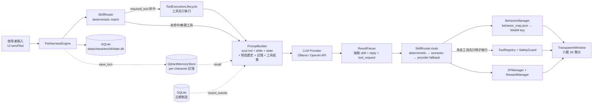
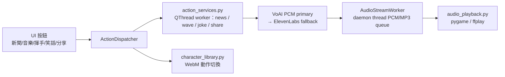

# ECHOES Virtual Pet

以 `PyQt5 + QWebEngineView` 為六層 2K 舞台外殼的桌面虛擬寵物專案。每個角色擁有獨立的 `PetHarnessEngine`（Skills / XP / Reward / Memory 全部隔離），`main.py` 只有一條啟動路徑，不接受 `--brain-mode` 參數。

| 項目 | 內容 |
|------|------|
| **對話大腦** | `PetHarnessEngine`（Ollama / OpenAI-compatible API），負責文字對話、skill 路由、工具呼叫、對話記憶、XP/獎勵、behavior→WebM 映射 |
| **本地快捷動作** | `ActionDispatcher` 子系統，獨立於對話大腦之外，驅動「新聞播報／播放音樂／揮手回應／固定笑話／固定分享」等 UI 按鈕，走 VoAI/ElevenLabs TTS |
| **離線安全** | 對話大腦 Yes（Ollama 免 API key）；本地快捷動作 No（需要 VoAI 或 ElevenLabs API key 才有語音） |

參考文件：

- [六層舞台架構 (Stage ArchViz)](docs/current_stage_archviz.md)
- [STT/TTS 運行狀態](docs/STTTTS.md)
- [Harness Agentic 控制面板](docs/current_test_ui_agentic_controls.md)
- [角色人設 (Personal)](docs/character_personal.md)
- [Linux 部署指南](docs/linux_deployment.md)

---

## 架構概覽

### Harness 對話流程


```mermaid
flowchart LR
    USER[使用者輸入<br>UI sendText] --> ENGINE[PetHarnessEngine]

    ENGINE --> ROUTE0[SkillRouter<br>deterministic match]
    ROUTE0 -- required_tool 命中 --> TOOLFIRST[ToolExecutionLifecycle<br>工具先行執行]
    TOOLFIRST --> PROMPT
    ROUTE0 -- 未命中/無需工具 --> PROMPT

    MEM[(QdrantMemoryStore<br>per-character 記憶)] -. recall .-> PROMPT
    HIST[(SQLite<br>近期對話)] -. recent_events .-> PROMPT

    PROMPT[PromptBuilder<br>soul.md + skills + state<br>+ 對話歷史 + 記憶 + 工具結果] --> LLM[LLM Provider<br>Ollama / OpenAI API]
    LLM --> PARSER[ResultParser<br>抽取 skill + reply + tool_request]

    PARSER --> ROUTER[SkillRouter.route<br>deterministic → semantic → provider fallback]
    ROUTER -- 未走工具先行時才執行 --> TOOLS[ToolRegistry + SafetyGuard]
    ROUTER --> BEHAVIOR[BehaviorManager<br>behavior_map.json → WebM key]
    ROUTER --> XP[XPManager + RewardManager]

    BEHAVIOR --> UI[TransparentWindow<br>六層 2K 舞台]
    TOOLS --> UI
    XP --> UI
    ENGINE --> DB[(SQLite<br>data/characters/id/state.db)]
    ENGINE -. save_turn .-> MEM
```

- **工具先行**：deterministic 命中且 skill 帶 `required_tool` 時（例如新聞、YouTube 音樂），先執行工具取得真實資料，再把 `ToolResult` 餵給 LLM 合成回覆——LLM 呼叫仍是一次，只是換了順序，避免回覆引用上一輪殘留的工具結果。
- **對話記憶**：短期記憶是近 6 輪 `SQLite` 對話歷史；長期記憶是 per-character 的 `QdrantMemoryStore`（本地嵌入式向量庫），兩者都在組 prompt 前注入，任何一方未就緒或故障都 fail-open（不中斷對話）。
- **語音輸入（STT）**：`sensors/stt_controller.py` 是 `UI sendText` 之外的第二個輸入來源——切換式錄音停止後，有效 transcript 會呼叫既有的 `TransparentWindow.submit_agentic_text()`，走與打字輸入完全相同的下游流程（`PetHarnessEngine` 看到的只是一般文字事件）；詳見下方「語音輸入（STT）」章節。

### 本地快捷動作子系統流程（與 Harness 大腦並行運作）


```mermaid
flowchart LR
    UI[UI 按鈕<br>新聞/音樂/揮手/笑話/分享] --> DISP[ActionDispatcher]
    DISP --> SVC[action_services.py<br>QThread worker：news / wave / joke / share]
    SVC --> TTS[VoAI PCM primary<br>→ ElevenLabs fallback]
    TTS --> AW[AudioStreamWorker<br>daemon thread PCM/MP3 queue]
    AW --> PLAY[audio_playback.py<br>pygame / ffplay]
    DISP --> MOTION[character_library.py<br>WebM 動作切換]
```

> 此子系統完全獨立於 `PetHarnessEngine`。`report_news`/`play_music`/`wave_response` 走固定腳本＋快取音檔；`cached_joke`/`cached_share` 首次觸發時會呼叫 LLM 產生文字後寫入快取，之後皆直接讀快取。

---

## Per-character 隔離

每個角色各自擁有：

- `PetHarnessEngine` instance（含自己的 `SkillRouter`、`ToolRegistry`）
- `data/characters/{character_id}/state.db` — SQLite 狀態（事件、XP、工具紀錄）
- `data/characters/{character_id}/qdrant/` — 對話記憶向量庫（與 skill 語意路由共用的 `runtime_cache/qdrant` 實體隔離，避免嵌入式 Qdrant 的檔案鎖衝突）
- `data/characters/{character_id}/profile.json`、`personal.json` — persona、技能授權、別名/優先度覆寫

角色切換由 `CharacterRouter.switch_character()` 原子性地替換整組 engine/profile/snapshot，不會出現分裂狀態。

---

## 目錄結構

```text
Virtual-Pet/
├── main.py                         # 應用程式進入點（唯一路徑，固定啟動 Harness）
├── config.py                       # 集中式設定中心（.env + persona + action 白名單）
├── character_library.py            # 角色清單、manifest 讀取、motion 映射（快捷動作＋Harness 共用）
├── interaction_trace.py            # 快捷動作互動延遲追蹤
├── action_dispatcher.py            # 本地快捷動作派發中樞、alias 正規化、TTS queue 管理
├── action_services.py              # 快捷動作背景 service worker（新聞 / 揮手 / 固定意圖快取）
├── text_utils.py                   # sanitize_tts_text：去除 ACTION 標記供 TTS 朗讀
├── audio_playback.py               # 快捷動作用 provider-neutral 播放器（ffplay / pygame）
├── audio_worker.py                 # 快捷動作用 trace-aware PCM session 播放 worker（daemon thread）
│
├── sensors/                        # 語音輸入（STT）：麥克風收音 + faster-whisper 辨識
│   ├── base_stt.py                 # BaseSTT ABC + TranscriptionResult（provider 可替換契約）
│   ├── faster_whisper_stt.py       # FasterWhisperSTT：CUDA-only 模型生命週期與轉錄
│   ├── microphone_recorder.py      # sounddevice InputStream 收音（mono/16kHz/float32 buffer）
│   └── stt_controller.py           # SttController：錄音 session 狀態機、背景 worker、一次性提交
│
├── api_client/
│   ├── adaptive_tts_fallback.py    # VoAI primary + ElevenLabs fallback 統一 contract
│   ├── voai_client.py              # VoAI HTTP PCM 串流 TTS client
│   ├── elevenlabs_client.py        # ElevenLabs fast-fallback TTS client
│   └── comfyui_client.py           # ComfyUI 算圖 client（未來資產生成用）
│
├── pet_harness/                    # ★ Harness 模式核心引擎
│   ├── engine/
│   │   ├── harness_engine.py       # 中央協調器：event → (工具先行) → prompt → LLM → parse → route → XP → DB
│   │   ├── tool_execution_lifecycle.py  # 工具執行閉環（安全授權/重試/預算/落庫）
│   │   └── media_session_context.py     # 新聞/音樂 session 上下文（per-character）
│   ├── agent/
│   │   ├── provider_factory.py     # LLM provider 工廠（Ollama / API）
│   │   ├── provider_adapter.py     # LLMProviderAdapter 抽象介面
│   │   ├── ollama_provider.py      # Ollama 本地推論 provider
│   │   ├── api_provider.py         # OpenAI-compatible REST provider
│   │   ├── prompt_builder.py       # Prompt 組裝（soul.md + agentic.md + skills + state + 對話歷史 + 記憶 + 工具結果）
│   │   └── result_parser.py        # LLM 回覆結構化解析（skill / reply / tool_request）
│   ├── memory/
│   │   ├── base_memory_store.py    # BaseMemoryStore ABC + NullMemoryStore（零開銷預設值）
│   │   └── qdrant_memory_store.py  # per-character 本地嵌入式向量記憶（背景寫入、fail-open 檢索）
│   ├── character/
│   │   ├── profile.py              # CharacterProfile（sqlite_path / qdrant_collection 等）
│   │   ├── registry.py             # CharacterRegistry（載入/建立/刪除角色）
│   │   ├── router.py               # CharacterRouter（角色切換中樞，持有 active engine）
│   │   └── customization_service.py # persona / local skill / 內建 skill 別名覆寫的驗證式讀寫
│   ├── behavior/
│   │   └── behavior_manager.py     # Skill → behavior_id / WebM key 映射
│   ├── models/
│   │   ├── events.py               # UserEvent / PetEvent / ToolRequestEvent / BehaviorEvent
│   │   ├── agent_result.py         # AgentResult（parsed LLM output）
│   │   ├── provider.py             # ProviderConfig / ProviderType / ProviderStatus
│   │   └── skill.py                # Skill dataclass
│   ├── skills/
│   │   ├── skill_loader.py         # 從 .agentic/skills/*.md 讀取 Skill 定義
│   │   ├── skill_router.py         # deterministic → semantic → provider fallback 路由
│   │   └── semantic_skill_retriever.py # Qdrant + fastembed 語意路由（shadow mode 預設開）
│   ├── storage/
│   │   ├── sqlite_store.py         # SQLite 持久層（XP / events / tool results / config）
│   │   └── schema.sql              # DB schema 定義
│   ├── tools/
│   │   ├── registry.py             # Tool 註冊表（自動註冊內建工具）
│   │   ├── safety_guard.py         # Tool 執行安全閘門（RiskLevel / ExecutionClass）
│   │   ├── web_article_tool.py     # 巴哈 GNN 今日新聞（RSS → HTTP → Playwright 三層 fallback）
│   │   ├── youtube_music_tool.py   # YouTube 播放（Playwright 持久化 context）
│   │   ├── music_search_tool.py / system_monitor_tool.py / timer_tool.py / random_tool.py
│   ├── runtime/
│   │   ├── playwright_browser_runtime.py  # 持久化 Chromium context（cookie 跨啟動保留，降低反自動化 403）
│   │   ├── browser_session_manager.py
│   │   └── provider_runtime.py     # 全域 LLM Provider 設定/健康狀態持有者
│   ├── xp/
│   │   ├── xp_manager.py           # XP 經驗值結算（per-skill + per-user）
│   │   └── reward_manager.py       # 獎勵解鎖檢查
│   └── ui/
│       ├── pyqt_harness_adapter.py # PyQt ↔ Harness Engine 橋接層
│       └── character_ui_service.py # 角色 CRUD / persona 面板服務
│
├── ui/
│   ├── transparent_window.py       # 透明桌面視窗 + Python↔JS bridge
│   ├── background_resolver.py      # 背景圖三級 fallback 解析
│   ├── settings_dialog.py          # 設定對話框
│   └── web_container/
│       ├── index.html              # 六層 2K 舞台 HTML（Skills / Persona / Style / Scene 面板見下）
│       ├── style.css               # 舞台 CSS（2560×1440 設計空間）
│       └── app.js                  # 前端控制（idle/motion/conversation/agentic panel）
│
├── assets/webm/characters/         # 角色資產（miku / Choppr：manifest.json + motions/）
│
├── .agentic/                       # Harness 人格與技能定義
│   ├── soul.md / agentic.md        # 核心人格與 agentic runtime 說明
│   ├── behavior/behavior_map.json  # Skill → 行為 / WebM 映射表
│   ├── rewards/reward_rules.json   # 獎勵規則
│   └── skills/                     # 技能定義（Markdown + frontmatter）：bahamut_daily_news / gacha_fortune / game_news / music_bgm / youtube_music_playback
│
├── data/characters/{id}/           # per-character 狀態：state.db、qdrant/、profile.json、personal.json
├── runtime_cache/                  # 執行期快取（news_audio / wave_audio / fixed_intents / qdrant 語意路由索引）
├── scripts/
│   ├── debug_harness.py            # Harness 引擎 CLI 除錯腳本
│   └── _verify_panel_video.py      # Panel video 手動驗證工具（QWebEngine headless-ish 截圖比對）
│
├── tests/                          # 單元測試（pytest -q）
├── docs/                           # 架構與部署文件
├── ComfyUI_API/                    # ComfyUI workflow JSON
└── requirements.txt
```

---

## Harness 引擎核心模組

### PetHarnessEngine (`pet_harness/engine/harness_engine.py`)

中央協調器。接收 `UserEvent`，依序執行：

1. **SkillRouter.match** — 對輸入文字做 deterministic 關鍵字比對
2. **工具先行**（若命中的 skill 帶 `required_tool`）— 先執行 `ToolExecutionLifecycle`，取得真實 `ToolResult`
3. **PromptBuilder** — 組裝 `soul.md` + `agentic.md` + 已載入 skills + state snapshot + 近期對話歷史 + 記憶檢索命中 + 工具結果
4. **LLM Provider** — 送給選定的 LLM（Ollama / OpenAI-compatible API）
5. **ResultParser** — 從回覆中抽取結構化結果（matched skill / reply / tool_request / confidence）
6. **SkillRouter.route** — deterministic → semantic（Qdrant shadow mode）→ provider 建議 → none
7. **BehaviorManager** — 依 matched skill 查 `behavior_map.json`，決定 behavior_id 與 WebM key
8. **ToolRegistry + SafetyGuard** — 若上一步未走工具先行且仍需要工具，過安全閘門後執行
9. **XPManager + RewardManager** — 結算經驗值，檢查獎勵解鎖
10. **SQLiteStore + QdrantMemoryStore** — 落庫事件，背景寫入本輪對話記憶

最終組合為 `PetEvent` 回傳給 UI 層。

### 對話記憶 (`pet_harness/memory/`)

- `BaseMemoryStore`（ABC）定義 `save_turn` / `recall` / `status`；呼叫端（`PetHarnessEngine`）只依賴介面，可替換。
- `NullMemoryStore` 是零開銷預設值：headless／測試環境下 `CharacterRouter` 不會建構真正的記憶庫。
- `QdrantMemoryStore` 是正式實作：本地嵌入式向量庫，寫入在背景執行緒完成，檢索 fail-open（未就緒或例外一律回空清單，絕不中斷對話）；FIFO 上限預設 500 筆。
- `CharacterRouter.switch_character()` 只在真正的桌面 App 內（`QApplication.instance() is not None`）才建構 `QdrantMemoryStore`，比照既有的語意路由索引慣例，避免 headless 測試觸發不必要的模型載入。

### LLM Provider 層 (`pet_harness/agent/`)

| Provider | 用途 | 需要網路 |
|----------|------|----------|
| `OllamaProvider` | 本地 Ollama 推論 | No（localhost） |
| `APIProvider` | OpenAI-compatible REST API | Yes |

透過 `provider_factory.py` 依 `ProviderConfig.provider_type` 分派；全域 `ProviderRuntime` 是唯一持有者，角色切換不影響 Provider 選擇。

### Skill 系統 (`pet_harness/skills/`)

技能定義放在 `.agentic/skills/*.md`，使用 frontmatter 描述觸發關鍵字、XP 獎勵、`required_tool`、`tool_policy`（含 `allowed_actions`/`defaults`）等。`SkillLoader` 在引擎初始化時掃描載入，`SkillRouter` 依 deterministic → semantic（Qdrant，預設 shadow mode 只記錄不生效）→ provider 建議的順序路由。

目前內建技能：`bahamut_daily_news`、`gacha_fortune`、`game_news`、`music_bgm`、`youtube_music_playback`。

### Tool 系統 (`pet_harness/tools/`)

所有工具執行前都會通過 `SafetyGuard` 檢查 `ToolRiskLevel` 與 `ToolExecutionClass`。媒體類工具（`web_article_tool`、`youtube_music_tool`）走 `PlaywrightBrowserRuntime` 的持久化 Chromium context。

### XP / 獎勵系統 (`pet_harness/xp/`)

- 每次互動自動結算 XP（matched skill 的 `xp_reward` 或預設 `chat_xp=2`）
- 工具成功執行額外獎勵
- `RewardManager` 依 XP 總量檢查 `reward_rules.json` 的解鎖條件

---

## 六層 2K 舞台模型

UI 固定以 `2560×1440` 設計空間、`min(vw/2560, vh/1440)` 縮放渲染：

| 層級 | 用途 |
|------|------|
| 1. `stage-background` | 角色專屬背景圖（`BackgroundResolver` 三級 fallback） |
| 2. `stage-pet-layer` | 角色 WebM 動作播放 |
| 3. `stage-live-ui` | 即時 UI（conversation panel、狀態列） |
| 4. `stage-bottom-ui` | 底部控制列 |
| 5. `stage-agentic-panel` | Companion Dock（Skills / Persona / Style / Scene，見下） |
| 6. Browser overlays | 瀏覽器原生覆蓋層 |

角色使用 CSS design token 定位（`--pet-anchor-x`、`--pet-floor-y`），底部置中錨定以確保 agentic panel 滑入時角色不偏移。

### Companion Dock 面板職責分離

| 面板 | 內容 |
|------|------|
| **Skills** (`dock-panel-agent`) | 技能清單（啟用/停用/立即執行）、內建技能別名／優先度覆寫、角色專屬 local skill CRUD、命中預覽 |
| **Persona** (`dock-panel-persona`) | 僅角色人設文字編輯（儲存／取消） |
| **Style** (`dock-panel-style`) | 造型版位（沿用既有角色與素材流程） |
| **Scene** (`dock-panel-scene`) | 場景版位（沿用既有背景與房間流程） |

四個面板互不包含彼此的介面元素；Skills 與 Persona 共用同一份 `getCustomization()` 後端資料（開啟任一面板都會重新載入），Style/Scene 目前僅占位。

---

## 本地快捷動作子系統（Harness 模式下仍在運作）

以下模組獨立於 `PetHarnessEngine`，由 UI 按鈕直接觸發固定動作：

- **`action_dispatcher.py`** — Action 白名單、alias 正規化、WebM 動作切換、TTS queue 管理中樞
- **`action_services.py`** — 新聞播報 / 揮手回應 / 固定笑話 / 固定分享的背景 QThread worker
- **`audio_worker.py`** — trace-aware PCM/MP3 串流播放 worker（daemon thread）
- **`audio_playback.py`** — pygame / ffplay 播放器實作
- **`character_library.py`** — 角色 motion 路徑解析（快捷動作與 Harness 共用）
- **`text_utils.py`** — TTS 前的 ACTION 標記清理
- **`api_client/adaptive_tts_fallback.py`** — VoAI primary + ElevenLabs fallback
- **`api_client/voai_client.py`** / **`api_client/elevenlabs_client.py`** — TTS client

---

## Action 白名單

Host 支援的 action（Harness 對話與快捷動作共用同一份白名單）：

`report_news` · `play_music` · `wave_response` · `laugh` · `angry` · `awkward` · `speechless` · `listen` · `idle`

常見 alias 自動正規化（`news` → `report_news`、`happy` → `laugh`、`music` → `play_music` 等）。

---

## 安裝

### 1. 建立並啟用虛擬環境

```bash
python -m venv venv
```

Windows PowerShell：
```powershell
.\venv\Scripts\Activate.ps1
```

Linux / macOS：
```bash
source venv/bin/activate
```

### 2. 安裝依賴

```bash
pip install -r requirements.txt
playwright install chromium
```

`playwright install chromium` 是使用 YouTube 播放與巴哈 GNN 今日新聞的必要步驟；若缺少 Chromium，工具會回傳可讀取的錯誤而不影響其他功能。

### 3. 設定 `.env`

**對話大腦最小設定（離線可用）：**

不需要任何 API key，預設走 Ollama（`OLLAMA_BASE_URL=http://localhost:11434`）。若要接 OpenAI-compatible API：

```bash
OPENAI_API_KEY=your_openai_api_key
OPENAI_MODEL=gpt-4o-mini
```

**本地快捷動作子系統設定（需要 TTS API key 才有語音，沒有也能跑，只是動作靜音）：**

```bash
VOAI_API_KEY=your_voai_api_key
ELEVENLABS_API_KEY=your_elevenlabs_api_key
```

**語音輸入（STT，faster-whisper，需要 NVIDIA CUDA GPU）：**

點擊 STT 按鈕開始/停止錄音，停止後在背景以 [faster-whisper](https://github.com/SYSTRAN/faster-whisper) 辨識（支援中文、英文、中英文混說，自動偵測語言，不翻譯）。沒有 CUDA/cuDNN 或麥克風也能正常使用文字輸入，STT 按鈕會顯示「STT 不可用」。

依賴（`requirements.txt` 已包含 `faster-whisper`、`sounddevice`、`numpy`，Windows 另包含 `nvidia-cublas-cu12`、`nvidia-cudnn-cu12`，隨標準安裝步驟一併裝好）。

CUDA/cuDNN 需求：第一版僅支援 `STT_DEVICE=cuda`（無 CPU fallback），需要可用的 NVIDIA GPU 與對應 cuDNN 9 / cuBLAS 執行環境。Windows 上 `ctranslate2` 是以傳統 PATH 搜尋載入 `cublas64_12.dll` 等 runtime DLL，`FasterWhisperSTT.setup()` 已自動把 pip 安裝的 `nvidia-cublas-cu12`/`nvidia-cudnn-cu12`/`nvidia-cuda-nvrtc-cu12` wheel 的 `bin/` 目錄前置進 `PATH`，通常不需手動設定；系統仍找不到對應 DLL/`.so` 時 `setup()` 會失敗，STT 按鈕維持 unavailable，不影響文字輸入。

`STT_*` 環境變數（皆有預設值，通常不需設定）：

| 變數 | 預設值 | 說明 |
|---|---|---|
| `STT_ENABLED` | `true` | 總開關；設為 `false` 完全不建立任何 STT 物件、按鈕維持 unavailable |
| `STT_MODEL` | `large-v3-turbo` | faster-whisper 模型名稱 |
| `STT_DEVICE` | `cuda` | 僅支援 `cuda`，無 CPU fallback |
| `STT_COMPUTE_TYPE` | `float16` | ctranslate2 計算精度 |
| `STT_MODEL_PATH` | `runtime_cache/whisper` | 模型下載/快取目錄，首次啟動下載後可離線重用 |
| `STT_LANGUAGE` | （空＝自動偵測） | 設為 `zh`/`en` 可固定語言，預設留空以支援中英混說 |
| `STT_BEAM_SIZE` | `1` | beam search 寬度 |
| `STT_SAMPLE_RATE` | `16000` | 錄音取樣率（Hz） |
| `STT_MIN_RECORDING_MS` | `300` | 低於此長度視為過短，丟棄不辨識 |
| `STT_MAX_RECORDING_SECONDS` | `30` | 單次錄音上限，超過自動停止收音 |

疑難排解：
- **`Library cublas64_12.dll is not found or cannot be loaded`**：主控台會印出 `[STT] session N 失敗：...（detail=...）`。確認 `pip show nvidia-cublas-cu12 nvidia-cudnn-cu12` 兩個套件都已安裝（`requirements.txt` 已宣告，重新 `pip install -r requirements.txt` 即可補齊）；此為 Windows 上最常見的 STT 失敗原因。
- **CUDA/cuDNN 缺失或版本不符**：STT 按鈕顯示「STT 不可用」，文字輸入不受影響；可設 `STT_ENABLED=false` 明確停用以跳過背景 preload。
- **找不到麥克風／權限不足**：點擊錄音會立即顯示一句錯誤提示並回到待命狀態，不影響其他功能。
- **首次啟動較慢**：模型檔（約 1.6GB）於首次 `setup()` 下載至 `STT_MODEL_PATH`，之後離線啟動可直接從快取載入。

<details>
<summary>可選環境變數</summary>

```bash
VOAI_PCM_STREAMING_ENABLED=true
ELEVENLABS_VOICE_ID=default_elevenlabs_voice_id
ELEVENLABS_MIKU_VOICE_ID=optional_miku_fallback_voice_id
ELEVENLABS_CHOPPER_VOICE_ID=optional_chopper_fallback_voice_id
ACTION_SYNC_TIMEOUT_MS=6000

# 語意 skill 路由（預設 shadow mode，只記錄候選不生效）
SEMANTIC_ROUTING_ENABLED=true
SEMANTIC_ROUTING_SHADOW_MODE=true
SEMANTIC_ROUTING_MODEL=sentence-transformers/paraphrase-multilingual-MiniLM-L12-v2
SEMANTIC_ROUTING_TOP_K=3
SEMANTIC_ROUTING_ACCEPT_THRESHOLD=0.60
SEMANTIC_ROUTING_MARGIN_THRESHOLD=0.08
QDRANT_MODE=local
QDRANT_PATH=runtime_cache/qdrant

# provider fallback
PROVIDER_ROUTING_FALLBACK_ENABLED=true
PROVIDER_ROUTING_CONFIDENCE_THRESHOLD=0.7

# 瀏覽器 session 復原
BROWSER_SESSION_RECOVERY_ENABLED=true
BROWSER_SESSION_RECOVERY_MAX_RETRIES=1
```

說明：
- `VOAI_PCM_STREAMING_ENABLED=false` 可回退到 MP3 BytesIO 播放
- `ACTION_SYNC_TIMEOUT_MS` 預設 `6000`，降低正常 VoAI 起播被誤判成 `timeout_promoted` 的機率
- 對話記憶（`QdrantMemoryStore`）沿用 `QDRANT_MODE`/`QDRANT_PATH`/`SEMANTIC_ROUTING_MODEL` 設定，但走獨立的 per-character 路徑（`data/characters/{id}/qdrant/`），不會與語意路由索引互相鎖檔

</details>

---

## 啟動

```bash
python main.py
```

Linux 若遇到 Qt / WebEngine / WebGL 問題，請參考 [linux_deployment.md](docs/linux_deployment.md)。

### Harness 引擎 CLI 除錯

```bash
python scripts/debug_harness.py
```

---

## 測試

```bash
python -m pytest -q
```

涵蓋角色系統（profile / registry / router / customization）、Harness 引擎（skill 路由、工具先行、對話記憶、去重）、UI bridge（runtime refresh gating、面板結構）、瀏覽器 session 復原等。真實 `QdrantMemoryStore` 生命週期驗證（`tests/test_memory_store.py`）在獨立子行程執行，避開 onnxruntime 在 Windows 上與 pytest 全套件執行順序相關的原生層級環境限制。

---

## 角色資產規則

角色資產放在 `assets/webm/characters/<character_id>/`：

```text
<character_id>/
├── manifest.json       # 動作清單、framing 設定
├── BG_Final.png        # 角色專屬背景
└── motions/            # 各動作 WebM 檔案
```

`manifest.json` 的 `motions` 建議至少包含：`idle`、`report_news`、`play_music`、`wave_response`、`laugh`、`angry`、`awkward`、`speechless`、`listen`。缺少時系統安全退回 idle。

可選的角色 framing 設定：

```json
{
  "layout": {
    "character_x_offset": 0,
    "character_y_offset": 0,
    "character_scale": 1.0,
    "object_position": "center bottom"
  }
}
```

---

## 媒體工具

- **巴哈 GNN 今日新聞**（`bahamut_daily_news` skill → `web_article_tool`）：RSS → HTTP → Playwright 三層 fallback；以文章 `id`（RSS guid）去重，不用去除 query string 的 URL（GNN 文章識別碼在 `?sn=` 參數，否則會把當日文章誤併成一篇）；回覆為前 5 篇逐篇重點整理。
- **YouTube 播放**（`youtube_music_playback` skill → `youtube_music_tool`）：`PlaywrightBrowserRuntime` 使用 `launch_persistent_context`，cookie／視覺指紋跨啟動累積，降低反自動化 403 斷流；自動播放被瀏覽器阻擋時回報「未驗證播放」，不會誤稱已播放。

## Skill routing

路由固定為 deterministic → semantic → provider → none。`SEMANTIC_ROUTING_ENABLED=true` 與預設的 `SEMANTIC_ROUTING_SHADOW_MODE=true` 只收集候選資料、不會新增工具呼叫；確認評估集後才將 shadow 設為 false。可調整 `SEMANTIC_ROUTING_{MODEL,TOP_K,ACCEPT_THRESHOLD,MARGIN_THRESHOLD}`、`QDRANT_{MODE,PATH,URL}`、`PROVIDER_ROUTING_{FALLBACK_ENABLED,CONFIDENCE_THRESHOLD}` 與 `BROWSER_SESSION_RECOVERY_{ENABLED,MAX_RETRIES}`。
