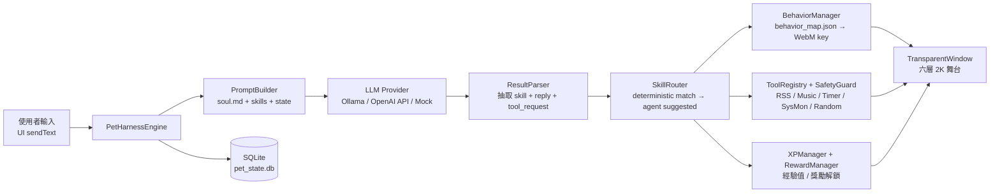
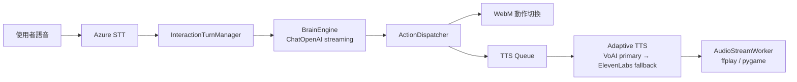

# ECHOES Virtual Pet

以 `PyQt5 + QWebEngineView` 為六層 2K 舞台外殼的桌面虛擬寵物專案。目前主線已整合兩套運行模式：

| 模式 | 啟動方式 | 大腦 | TTS | 離線安全 |
|------|----------|------|-----|----------|
| **Harness** | `--brain-mode harness`（目前預設） | `PetHarnessEngine`（Ollama / OpenAI API / Mock） | — | Yes |
| **Auto (Live)** | `--brain-mode auto` | `BrainEngine`（OpenAI GPT-4o-mini streaming） | VoAI PCM → ElevenLabs fallback | No |

> **目前 `main.py` 只啟動 Harness 模式。** Live 模式的原始元件（Azure STT、OpenAI streaming、VoAI/ElevenLabs TTS、WaveSensor）仍保留在程式庫中供後續整合。

參考文件：

- [六層舞台架構 (Stage ArchViz)](docs/current_stage_archviz.md)
- [STT/TTS 運行狀態](docs/STTTTS.md)
- [Harness Agentic 控制面板](docs/current_test_ui_agentic_controls.md)
- [Linux 部署指南](docs/linux_deployment.md)

---

## 架構概覽

### Harness 模式流程


```mermaid
flowchart LR
    USER[使用者輸入<br>UI sendText] --> ENGINE[PetHarnessEngine]

    ENGINE --> PROMPT[PromptBuilder<br>soul.md + skills + state]
    PROMPT --> LLM[LLM Provider<br>Ollama / OpenAI API / Mock]
    LLM --> PARSER[ResultParser<br>抽取 skill + reply + tool_request]

    PARSER --> ROUTER[SkillRouter<br>deterministic match → agent suggested]
    ROUTER --> BEHAVIOR[BehaviorManager<br>behavior_map.json → WebM key]
    ROUTER --> TOOLS[ToolRegistry + SafetyGuard<br>RSS / Music / Timer / SysMon / Random]
    ROUTER --> XP[XPManager + RewardManager<br>經驗值 / 獎勵解鎖]

    BEHAVIOR --> UI[TransparentWindow<br>六層 2K 舞台]
    TOOLS --> UI
    XP --> UI
    ENGINE --> DB[(SQLite<br>pet_state.db)]
```

### Live 模式流程（保留，未接入 main.py）


```mermaid
flowchart LR
    U[使用者語音] --> STT[Azure STT]
    STT --> TURN[InteractionTurnManager]
    TURN --> BRAIN[BrainEngine<br>ChatOpenAI streaming]
    BRAIN --> DISP[ActionDispatcher]
    DISP --> MOTION[WebM 動作切換]
    DISP --> TTSQ[TTS Queue]
    TTSQ --> TTS[Adaptive TTS<br>VoAI primary → ElevenLabs fallback]
    TTS --> PLAY[AudioStreamWorker<br>ffplay / pygame]
```

---

## 目錄結構

```text
Virtual-Pet/
├── main.py                         # 應用程式進入點（目前僅啟動 Harness 模式）
├── config.py                       # 集中式設定中心（.env + persona + action 白名單）
├── character_library.py            # 角色清單、manifest 讀取、motion 映射
├── interaction_trace.py            # 互動延遲追蹤（STT / LLM / Action / TTS 里程碑）
├── interaction_turn_manager.py     # 一輪一輪互動序列化（Live 模式用）
├── action_dispatcher.py            # 動作派發、alias 正規化、TTS queue 管理
├── action_services.py              # 背景 service worker（新聞 / 揮手 / 固定意圖快取）
├── text_utils.py                   # 文字工具
├── audio_playback.py               # Provider-neutral 播放器（ffplay / pygame）
├── audio_worker.py                 # Trace-aware PCM session 播放 worker
│
├── api_client/
│   ├── adaptive_tts_fallback.py    # VoAI primary + ElevenLabs fallback 統一 contract
│   ├── voai_client.py              # VoAI HTTP PCM 串流 TTS client
│   ├── elevenlabs_client.py        # ElevenLabs fast-fallback TTS client
│   └── comfyui_client.py           # ComfyUI 算圖 client（未來資產生成用）
│
├── sensors/
│   ├── microphone_stt.py           # Azure STT 背景收音
│   ├── stt_session_controller.py   # STT session 控制與狀態機
│   └── camera_vision.py            # OpenCV + MediaPipe 揮手感測
│
├── pet_harness/                    # ★ Harness 模式核心引擎
│   ├── __init__.py                 # 匯出 PetHarnessEngine
│   ├── voice_runtime_status_adapter.py  # 語音運行狀態正規化
│   ├── engine/
│   │   └── harness_engine.py       # 中央協調器：event → prompt → LLM → parse → route → XP → DB
│   ├── agent/
│   │   ├── provider_factory.py     # LLM provider 工廠（Ollama / API / LowSpec / Mock）
│   │   ├── provider_adapter.py     # LLMProviderAdapter 抽象介面
│   │   ├── ollama_provider.py      # Ollama 本地推論 provider
│   │   ├── api_provider.py         # OpenAI-compatible REST provider
│   │   ├── low_spec_provider.py    # 輕量回退 provider
│   │   ├── mock_provider.py        # 離線測試用 Mock provider
│   │   ├── langchain_adapter.py    # LangChain 整合 adapter
│   │   ├── prompt_builder.py       # Prompt 組裝（soul.md + agentic.md + skills + state）
│   │   └── result_parser.py        # LLM 回覆結構化解析（skill / reply / tool_request）
│   ├── behavior/
│   │   └── behavior_manager.py     # Skill → behavior_id / WebM key 映射
│   ├── models/
│   │   ├── events.py               # UserEvent / PetEvent / ToolRequestEvent / BehaviorEvent
│   │   ├── agent_result.py         # AgentResult（parsed LLM output）
│   │   ├── provider.py             # ProviderConfig / ProviderType / ProviderStatus
│   │   ├── skill.py                # Skill dataclass
│   │   └── reward.py               # RewardEvent / RewardRule
│   ├── skills/
│   │   ├── skill_loader.py         # 從 .agentic/skills/*.md 讀取 Skill 定義
│   │   └── skill_router.py         # 關鍵字比對 + agent 建議的 Skill 路由
│   ├── storage/
│   │   ├── sqlite_store.py         # SQLite 持久層（XP / events / tool results / config）
│   │   └── schema.sql              # DB schema 定義
│   ├── tools/
│   │   ├── registry.py             # Tool 註冊表（自動註冊內建工具）
│   │   ├── safety_guard.py         # Tool 執行安全閘門（RiskLevel / ExecutionClass）
│   │   ├── tool_models.py          # ToolRequest / ToolResult / ToolDefinition
│   │   ├── rss_tool.py             # RSS 新聞抓取工具
│   │   ├── music_search_tool.py    # 音樂搜尋工具
│   │   ├── system_monitor_tool.py  # 系統監控工具
│   │   ├── timer_tool.py           # 計時器工具
│   │   └── random_tool.py          # 隨機數工具
│   ├── xp/
│   │   ├── xp_manager.py           # XP 經驗值結算（per-skill + per-user）
│   │   └── reward_manager.py       # 獎勵解鎖檢查
│   ├── asset/
│   │   ├── service.py              # AssetService 抽象介面
│   │   ├── asset_contract.py       # AssetRequest / AssetResponse dataclass
│   │   ├── comfyui_asset_service.py # ComfyUI 實作（未來用）
│   │   └── mock_asset_service.py   # 離線 Mock 資產服務
│   └── ui/
│       └── pyqt_harness_adapter.py # PyQt ↔ Harness Engine 橋接層
│
├── ui/
│   ├── transparent_window.py       # 透明桌面視窗 + Python↔JS bridge
│   ├── background_resolver.py      # 背景圖三級 fallback 解析
│   ├── settings_dialog.py          # 設定對話框
│   └── web_container/
│       ├── index.html              # 六層 2K 舞台 HTML
│       ├── style.css               # 舞台 CSS（2560×1440 設計空間）
│       └── app.js                  # 前端控制（idle/motion/conversation/agentic panel）
│
├── assets/webm/characters/         # 角色資產
│   ├── miku/                       # 初音角色（manifest.json + motions/）
│   └── Choppr/                     # 喬巴角色（manifest.json + motions/）
│
├── .agentic/                       # Harness 人格與技能定義
│   ├── soul.md                     # 核心人格描述
│   ├── agentic.md                  # Agentic runtime 說明
│   ├── behavior/behavior_map.json  # Skill → 行為 / WebM 映射表
│   ├── rewards/reward_rules.json   # 獎勵規則
│   └── skills/                     # 技能定義（Markdown + frontmatter）
│       ├── break_reminder.md
│       ├── gacha_fortune.md
│       ├── game_news.md
│       ├── music_bgm.md
│       └── system_monitor.md
│
├── data/
│   └── pet_state.db                # SQLite 持久化資料庫
│
├── runtime_cache/                  # 執行期快取
│   ├── news_audio/                 # 固定新聞播報 MP3
│   ├── wave_audio/                 # 固定揮手問候 MP3
│   └── fixed_intents/              # joke/share 的文字 metadata + MP3
│
├── scripts/
│   ├── debug_harness.py            # Harness 引擎 CLI 除錯腳本
│   ├── smoke_test.py               # 冒煙測試（Live 模式 API + latency probe）
│   ├── live_stt_latency_probe.py   # 真實 STT 端到端延遲量測
│   └── _verify_panel_video.py      # Panel video 驗證工具
│
├── tests/                          # 單元測試
├── docs/                           # 架構與部署文件
├── ComfyUI_API/                    # ComfyUI workflow JSON
└── requirements.txt
```

---

## Harness 引擎核心模組

### PetHarnessEngine (`pet_harness/engine/harness_engine.py`)

中央協調器。接收 `UserEvent`，依序執行：

1. **PromptBuilder** — 組裝 `soul.md` + `agentic.md` + 已載入 skills + 當前 state snapshot 成完整 prompt
2. **LLM Provider** — 將 prompt 送給選定的 LLM（Ollama / OpenAI API / LowSpec / Mock）
3. **ResultParser** — 從 LLM 回覆中抽取結構化結果（matched skill / reply / tool_request / confidence）
4. **SkillRouter** — 先做關鍵字 deterministic match，再考慮 agent 建議，決定最終 matched skill
5. **BehaviorManager** — 依 matched skill 查 `behavior_map.json`，決定 behavior_id 與 WebM key
6. **ToolRegistry + SafetyGuard** — 若 skill 或 agent 要求工具，先過安全閘門再執行
7. **XPManager + RewardManager** — 結算經驗值，檢查獎勵解鎖
8. **SQLiteStore** — 持久化事件、XP、工具結果、provider 狀態

最終組合為 `PetEvent` 回傳給 UI 層。

### LLM Provider 層 (`pet_harness/agent/`)

| Provider | 用途 | 需要網路 |
|----------|------|----------|
| `OllamaProvider` | 本地 Ollama 推論 | No（localhost） |
| `APIProvider` | OpenAI-compatible REST API | Yes |
| `LowSpecProvider` | 輕量回退（低規設備） | No |
| `MockProvider` | 離線測試 | No |

透過 `provider_factory.py` 依 `ProviderConfig.provider_type` 分派。

### Skill 系統 (`pet_harness/skills/`)

技能定義放在 `.agentic/skills/*.md`，使用 YAML frontmatter 描述觸發關鍵字、XP 獎勵、所需工具等。`SkillLoader` 在引擎初始化時掃描載入，`SkillRouter` 在每次事件中做路由。

目前內建技能：`break_reminder`、`gacha_fortune`、`game_news`、`music_bgm`、`system_monitor`。

### Tool 系統 (`pet_harness/tools/`)

內建五個工具：`rss_tool`、`music_search_tool`、`system_monitor_tool`、`timer_tool`、`random_tool`。所有工具執行前都會通過 `SafetyGuard` 檢查 `ToolRiskLevel` 與 `ToolExecutionClass`。

### XP / 獎勵系統 (`pet_harness/xp/`)

- 每次互動自動結算 XP（matched skill 的 `xp_reward` 或預設 `chat_xp=2`）
- 工具成功執行額外獎勵
- `RewardManager` 依 XP 總量檢查 `reward_rules.json` 的解鎖條件

---

## 六層 2K 舞台模型

UI 固定以 `2560×1440` 設計空間、`min(vw/2560, vh/1440)` 縮放渲染：

| 層級 | 用途 |
|------|------|
| 1. `stage-background` | 角色專屬背景圖（`BackgroundResolver` 三級 fallback） |
| 2. `stage-pet-layer` | 角色 WebM 動作播放 |
| 3. `stage-live-ui` | 即時 UI（conversation panel、狀態列） |
| 4. `stage-bottom-ui` | 底部控制列 |
| 5. `stage-agentic-panel` | Harness 模式 agentic 控制面板 |
| 6. Browser overlays | 瀏覽器原生覆蓋層 |

角色使用 CSS design token 定位（`--pet-anchor-x`、`--pet-floor-y`），底部置中錨定以確保 agentic panel 滑入時角色不偏移。

---

## Live 模式核心模組（保留）

以下模組在 `--brain-mode auto` 時啟用，目前未接入 `main.py`：

- **`interaction_turn_manager.py`** — STT 與 Dev Query 序列化成逐輪互動
- **`api_client/brain_engine.py`** — OpenAI streaming，拆成 `token_streamed` / `streamed_fragment` / `sentence_ready`
- **`action_dispatcher.py`** — Action 白名單、alias 正規化、WebM 動作切換、TTS queue
- **`api_client/adaptive_tts_fallback.py`** — VoAI primary + ElevenLabs fallback
- **`api_client/voai_client.py`** — VoAI HTTP PCM 串流 TTS
- **`api_client/elevenlabs_client.py`** — ElevenLabs fast-fallback TTS
- **`sensors/microphone_stt.py`** — Azure STT 背景收音
- **`sensors/camera_vision.py`** — OpenCV 揮手感測

---

## Action 白名單

Host 支援的 action（兩種模式共用）：

`report_news` · `play_music` · `wave_response` · `laugh` · `angry` · `awkward` · `speechless` · `listen` · `idle`

常見 alias 自動正規化（`news` → `report_news`、`happy` → `laugh`、`music` → `play_music` 等）。

---

## 安裝

### 1. 建立並啟用虛擬環境

```bash
python -m venv venv
```

Windows PowerShell：
```powershell
.\venv\Scripts\Activate.ps1
```

Linux / macOS：
```bash
source venv/bin/activate
```

### 2. 安裝依賴

```bash
pip install -r requirements.txt
```

### 3. 設定 `.env`

**Harness 模式最小設定（離線可用）：**

不需要任何 API key。預設使用 `MockProvider`。若要接 Ollama：

```bash
HARNESS_PROVIDER_TYPE=ollama
OLLAMA_BASE_URL=http://localhost:11434
OLLAMA_MODEL=minimax-m2.7:cloud
```

若要接 OpenAI-compatible API：

```bash
HARNESS_PROVIDER_TYPE=api
OPENAI_API_KEY=your_openai_api_key
OPENAI_MODEL=gpt-4o-mini
```

**Live 模式完整設定（需要 API key）：**

```bash
OPENAI_API_KEY=your_openai_api_key
OPENAI_MODEL=gpt-4o-mini
VOAI_API_KEY=your_voai_api_key
ELEVENLABS_API_KEY=your_elevenlabs_api_key
AZURE_STT_API_KEY=your_azure_speech_key
AZURE_STT_REGION=eastus
AZURE_STT_LANGUAGE=zh-TW
AZURE_STT_ENABLED=true
```

<details>
<summary>可選環境變數</summary>

```bash
VOAI_PCM_STREAMING_ENABLED=true
CHATGPT_API_KEY=your_openai_api_key_fallback
BRAIN_MEMORY_MAX_TURNS=6
BRAIN_SENTENCE_MIN_CHARS=15
OPENAI_TEMPERATURE=0.4
ELEVENLABS_VOICE_ID=default_elevenlabs_voice_id
ELEVENLABS_MIKU_VOICE_ID=optional_miku_fallback_voice_id
ELEVENLABS_CHOPPER_VOICE_ID=optional_chopper_fallback_voice_id
ACTION_SYNC_TIMEOUT_MS=6000
AZURE_STT_INITIAL_SILENCE_TIMEOUT_MS=5000
AZURE_STT_END_SILENCE_TIMEOUT_MS=350
AZURE_STT_SEGMENTATION_SILENCE_TIMEOUT_MS=300
AZURE_STT_SEGMENTATION_MAX_TIME_MS=4000
```

說明：
- `CHATGPT_API_KEY` 為 `OPENAI_API_KEY` 的 fallback
- `VOAI_PCM_STREAMING_ENABLED=false` 可回退到 MP3 BytesIO 播放
- `ACTION_SYNC_TIMEOUT_MS` 預設 `6000`，降低正常 VoAI 起播被誤判成 `timeout_promoted` 的機率
- `BRAIN_SENTENCE_MIN_CHARS` 調整全句級 `sentence_ready` 最小字數門檻，預設 `15`
- `BRAIN_MEMORY_MAX_TURNS` 限制保留的最近對話輪數，避免上下文膨脹

</details>

---

## 啟動

```bash
python main.py
```

目前預設啟動 Harness 模式。Linux 若遇到 Qt / WebEngine / WebGL 問題，請參考 [linux_deployment.md](docs/linux_deployment.md)。

### Harness 引擎 CLI 除錯

```bash
python scripts/debug_harness.py
```

---

## 測試

### 單元測試

```bash
python -m pytest tests/ -v
```

目前測試涵蓋：

- Action / motion / TTS queue 播放順序
- 同 trace PCM session 的 single `driver_started`、逐句 `playback_finished` 與中途中斷
- `report_news` / `play_music` loop action 的重複觸發保護
- 固定新聞音檔 cache miss / hit
- `Joke/share` 固定意圖 cache miss / hit、角色隔離
- Reset 對互動佇列與角色記憶的清理
- OpenAI 串流切片、全句級緩衝與安全降級
- VoAI HTTP PCM primary path、adaptive fallback、text-only 降級
- Interaction turn 排隊與完成順序
- STT 控制與延遲追蹤
- Wave sensor 整合

### 冒煙測試（Live 模式）

```bash
python scripts/smoke_test.py
python scripts/smoke_test.py --mock-tts-fail voai529      # VoAI 529 → ElevenLabs fallback
python scripts/smoke_test.py --mock-tts-fail double-fail   # 雙 provider 失敗 → text-only 降級
```

### 真實 STT 端到端量測

```bash
python scripts/live_stt_latency_probe.py
```

---

## 角色資產規則

角色資產放在 `assets/webm/characters/<character_id>/`：

```text
<character_id>/
├── manifest.json       # 動作清單、framing 設定
├── BG_Final.png        # 角色專屬背景
└── motions/            # 各動作 WebM 檔案
```

`manifest.json` 的 `motions` 建議至少包含：`idle`、`report_news`、`play_music`、`wave_response`、`laugh`、`angry`、`awkward`、`speechless`、`listen`。缺少時系統安全退回 idle。

可選的角色 framing 設定：

```json
{
  "layout": {
    "character_x_offset": 0,
    "character_y_offset": 0,
    "character_scale": 1.0,
    "object_position": "center bottom"
  }
}
```

---

## 延遲摘要判讀（Live 模式）

每輪互動完成後，terminal 會輸出摘要：

```text
[ECHOES][TRACE][abcd1234] 互動完成摘要 source=stt total=1710ms | stages: stt_tail=212ms; ...
```

關鍵指標：

| 指標 | 意義 |
|------|------|
| `stt_tail` | Azure 停口偵測 → finalized text |
| `llm_to_first_output` | OpenAI 開始推論 → 第一片段 |
| `first_token_visible` | 第一個可見 token 到達 UI |
| `eos_to_first_action` | 停口 → 第一個 action dispatch |
| `first_driver_started` | 第一段音訊交給播放驅動 |
| `eos_to_first_audio` | 停口 → 首次音訊交給播放驅動 |
| `eos_to_complete` | 停口 → 整輪互動完成 |
| `bottleneck` | 該輪最慢階段 |

`smoke_test.py` 多輪量測預設需 `median_eos_to_complete <= 1800ms`。

---

## 開發備註

- 若要理解目前程式真實結構，請優先看本 README 與 `docs/current_stage_archviz.md`。
- `docs/` 內文件為目前架構參考；歷史文件已清理。
- Harness 模式目前使用 deterministic skill routing（Week 1 設計），tool use request 為 metadata-only。
- ComfyUI 資產生成仍在 future FastAPI JSON contract 之後。
- 舊 `OLLAMA_*` 設定保留在 `config.py` 做相容，但已不是 Live 模式互動主路徑。
