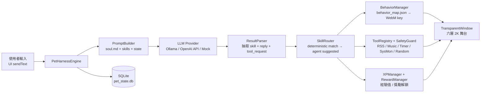
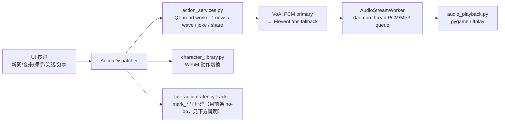
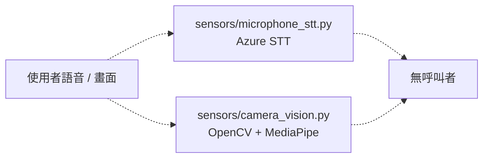

# ECHOES Virtual Pet

以 `PyQt5 + QWebEngineView` 為六層 2K 舞台外殼的桌面虛擬寵物專案。`main.py` 目前只有一條啟動路徑，且不接受 `--brain-mode` 參數：

| 項目 | 內容 |
|------|------|
| **對話大腦** | `PetHarnessEngine`（Ollama / OpenAI-compatible API / Mock），負責文字對話、skill 路由、XP/獎勵、behavior→WebM 映射 |
| **本地快捷動作** | `ActionDispatcher` 子系統，獨立於對話大腦之外，驅動「新聞播報／播放音樂／揮手回應／固定笑話／固定分享」等 UI 按鈕，走 VoAI/ElevenLabs TTS |
| **離線安全** | 對話大腦 Yes（Mock/Ollama 免 API key）；本地快捷動作 No（需要 VoAI 或 ElevenLabs API key 才有語音） |

> **舊版 LangChain `BrainEngine` + Azure STT 語音對話管線已經被移除**（見 `openspec/changes/archive/2026-06-26-remove-legacy-openclaw-runtime/`），`api_client/brain_engine.py`、`database.py`、`brain_mode.py` 皆已從程式庫刪除，`--brain-mode` CLI 參數也已不存在。`interaction_turn_manager.py`、`sensors/stt_session_controller.py`、以及依賴它們的 `scripts/smoke_test.py`、`scripts/live_stt_latency_probe.py` 已確認無任何主線程式碼引用，於後續清理中一併刪除。僅 `sensors/microphone_stt.py`、`sensors/camera_vision.py` 兩個更底層的感測器模組仍保留（同樣無人呼叫），詳見〈孤兒模組〉一節。

參考文件：

- [六層舞台架構 (Stage ArchViz)](docs/current_stage_archviz.md)
- [STT/TTS 運行狀態](docs/STTTTS.md)
- [Harness Agentic 控制面板](docs/current_test_ui_agentic_controls.md)
- [Linux 部署指南](docs/linux_deployment.md)

---

## 架構概覽

### Harness 模式流程


```mermaid
flowchart LR
    USER[使用者輸入<br>UI sendText] --> ENGINE[PetHarnessEngine]

    ENGINE --> PROMPT[PromptBuilder<br>soul.md + skills + state]
    PROMPT --> LLM[LLM Provider<br>Ollama / OpenAI API / Mock]
    LLM --> PARSER[ResultParser<br>抽取 skill + reply + tool_request]

    PARSER --> ROUTER[SkillRouter<br>deterministic match → agent suggested]
    ROUTER --> BEHAVIOR[BehaviorManager<br>behavior_map.json → WebM key]
    ROUTER --> TOOLS[ToolRegistry + SafetyGuard<br>RSS / Music / Timer / SysMon / Random]
    ROUTER --> XP[XPManager + RewardManager<br>經驗值 / 獎勵解鎖]

    BEHAVIOR --> UI[TransparentWindow<br>六層 2K 舞台]
    TOOLS --> UI
    XP --> UI
    ENGINE --> DB[(SQLite<br>pet_state.db)]
```

### 本地快捷動作子系統流程（與 Harness 大腦並行運作）


```mermaid
flowchart LR
    UI[UI 按鈕<br>新聞/音樂/揮手/笑話/分享] --> DISP[ActionDispatcher]
    DISP --> SVC[action_services.py<br>QThread worker：news / wave / joke / share]
    SVC --> TTS[VoAI PCM primary<br>→ ElevenLabs fallback]
    TTS --> AW[AudioStreamWorker<br>daemon thread PCM/MP3 queue]
    AW --> PLAY[audio_playback.py<br>pygame / ffplay]
    DISP --> MOTION[character_library.py<br>WebM 動作切換]
    DISP -.-> TRACE[InteractionLatencyTracker<br>mark_* 里程碑（目前為 no-op，見下方說明）]
```

> 此子系統完全獨立於 `PetHarnessEngine`。`report_news`/`play_music`/`wave_response` 走固定腳本＋快取音檔；`cached_joke`/`cached_share` 首次觸發時會呼叫 `langchain_openai.ChatOpenAI`（需要 `OPENAI_API_KEY`）產生文字後寫入快取，之後皆直接讀快取，不再重新呼叫 LLM。

### 孤兒感測器模組（已斷鏈，未被任何主線程式碼呼叫）


```mermaid
flowchart LR
    U[使用者語音 / 畫面] -.-> STT[sensors/microphone_stt.py<br>Azure STT]
    U -.-> CAM[sensors/camera_vision.py<br>OpenCV + MediaPipe]
    STT -.-> X[無呼叫者]
    CAM -.-> X
```

> 原本串接這兩個感測器的 `interaction_turn_manager.py`、`sensors/stt_session_controller.py`，以及依賴它們的開發腳本 `scripts/smoke_test.py`、`scripts/live_stt_latency_probe.py` 已於清理中刪除（確認無任何主線程式碼引用後移除）。`microphone_stt.py`、`camera_vision.py` 兩者本身目前仍保留，但同樣沒有任何呼叫者，是否復活語音/視覺輸入尚待決定。

---

## 目錄結構

```text
Virtual-Pet/
├── main.py                         # 應用程式進入點（唯一路徑，無 CLI 參數，固定啟動 Harness）
├── config.py                       # 集中式設定中心（.env + persona + action 白名單）
├── character_library.py            # 角色清單、manifest 讀取、motion 映射（快捷動作＋Harness 共用）
├── interaction_trace.py            # 互動延遲追蹤（已清理 STT/brain 死碼）；⚠️ begin_interaction 目前無人呼叫，實際上是全域 no-op
├── action_dispatcher.py            # 本地快捷動作派發中樞、alias 正規化、TTS queue 管理
├── action_services.py              # 快捷動作背景 service worker（新聞 / 揮手 / 固定意圖快取）
├── text_utils.py                   # sanitize_tts_text：去除 ACTION 標記供 TTS 朗讀
├── audio_playback.py               # 快捷動作用 provider-neutral 播放器（ffplay / pygame）
├── audio_worker.py                 # 快捷動作用 trace-aware PCM session 播放 worker（daemon thread）
│
├── api_client/
│   ├── adaptive_tts_fallback.py    # VoAI primary + ElevenLabs fallback 統一 contract
│   ├── voai_client.py              # VoAI HTTP PCM 串流 TTS client
│   ├── elevenlabs_client.py        # ElevenLabs fast-fallback TTS client
│   └── comfyui_client.py           # ComfyUI 算圖 client（未來資產生成用）
│
├── sensors/                         # 孤兒模組：以下皆無主線呼叫者，見下方孤兒清單
│   ├── microphone_stt.py           # Azure STT 背景收音（已斷鏈）
│   └── camera_vision.py            # OpenCV + MediaPipe 揮手感測（已斷鏈）
│
├── pet_harness/                    # ★ Harness 模式核心引擎
│   ├── __init__.py                 # 匯出 PetHarnessEngine
│   ├── voice_runtime_status_adapter.py  # 語音運行狀態正規化
│   ├── engine/
│   │   └── harness_engine.py       # 中央協調器：event → prompt → LLM → parse → route → XP → DB
│   ├── agent/
│   │   ├── provider_factory.py     # LLM provider 工廠（Ollama / API / LowSpec / Mock）
│   │   ├── provider_adapter.py     # LLMProviderAdapter 抽象介面
│   │   ├── ollama_provider.py      # Ollama 本地推論 provider
│   │   ├── api_provider.py         # OpenAI-compatible REST provider
│   │   ├── low_spec_provider.py    # 輕量回退 provider
│   │   ├── mock_provider.py        # 離線測試用 Mock provider
│   │   ├── langchain_adapter.py    # LangChain 整合 adapter
│   │   ├── prompt_builder.py       # Prompt 組裝（soul.md + agentic.md + skills + state）
│   │   └── result_parser.py        # LLM 回覆結構化解析（skill / reply / tool_request）
│   ├── behavior/
│   │   └── behavior_manager.py     # Skill → behavior_id / WebM key 映射
│   ├── models/
│   │   ├── events.py               # UserEvent / PetEvent / ToolRequestEvent / BehaviorEvent
│   │   ├── agent_result.py         # AgentResult（parsed LLM output）
│   │   ├── provider.py             # ProviderConfig / ProviderType / ProviderStatus
│   │   ├── skill.py                # Skill dataclass
│   │   └── reward.py               # RewardEvent / RewardRule
│   ├── skills/
│   │   ├── skill_loader.py         # 從 .agentic/skills/*.md 讀取 Skill 定義
│   │   └── skill_router.py         # 關鍵字比對 + agent 建議的 Skill 路由
│   ├── storage/
│   │   ├── sqlite_store.py         # SQLite 持久層（XP / events / tool results / config）
│   │   └── schema.sql              # DB schema 定義
│   ├── tools/
│   │   ├── registry.py             # Tool 註冊表（自動註冊內建工具）
│   │   ├── safety_guard.py         # Tool 執行安全閘門（RiskLevel / ExecutionClass）
│   │   ├── tool_models.py          # ToolRequest / ToolResult / ToolDefinition
│   │   ├── rss_tool.py             # RSS 新聞抓取工具
│   │   ├── music_search_tool.py    # 音樂搜尋工具
│   │   ├── system_monitor_tool.py  # 系統監控工具
│   │   ├── timer_tool.py           # 計時器工具
│   │   └── random_tool.py          # 隨機數工具
│   ├── xp/
│   │   ├── xp_manager.py           # XP 經驗值結算（per-skill + per-user）
│   │   └── reward_manager.py       # 獎勵解鎖檢查
│   ├── asset/
│   │   ├── service.py              # AssetService 抽象介面
│   │   ├── asset_contract.py       # AssetRequest / AssetResponse dataclass
│   │   ├── comfyui_asset_service.py # ComfyUI 實作（未來用）
│   │   └── mock_asset_service.py   # 離線 Mock 資產服務
│   └── ui/
│       └── pyqt_harness_adapter.py # PyQt ↔ Harness Engine 橋接層
│
├── ui/
│   ├── transparent_window.py       # 透明桌面視窗 + Python↔JS bridge
│   ├── background_resolver.py      # 背景圖三級 fallback 解析
│   ├── settings_dialog.py          # 設定對話框
│   └── web_container/
│       ├── index.html              # 六層 2K 舞台 HTML
│       ├── style.css               # 舞台 CSS（2560×1440 設計空間）
│       └── app.js                  # 前端控制（idle/motion/conversation/agentic panel）
│
├── assets/webm/characters/         # 角色資產
│   ├── miku/                       # 初音角色（manifest.json + motions/）
│   └── Choppr/                     # 喬巴角色（manifest.json + motions/）
│
├── .agentic/                       # Harness 人格與技能定義
│   ├── soul.md                     # 核心人格描述
│   ├── agentic.md                  # Agentic runtime 說明
│   ├── behavior/behavior_map.json  # Skill → 行為 / WebM 映射表
│   ├── rewards/reward_rules.json   # 獎勵規則
│   └── skills/                     # 技能定義（Markdown + frontmatter）
│       ├── break_reminder.md
│       ├── gacha_fortune.md
│       ├── game_news.md
│       ├── music_bgm.md
│       └── system_monitor.md
│
├── data/
│   └── pet_state.db                # SQLite 持久化資料庫
│
├── runtime_cache/                  # 執行期快取
│   ├── news_audio/                 # 固定新聞播報 MP3
│   ├── wave_audio/                 # 固定揮手問候 MP3
│   └── fixed_intents/              # joke/share 的文字 metadata + MP3
│
├── scripts/
│   ├── debug_harness.py            # Harness 引擎 CLI 除錯腳本
│   └── _verify_panel_video.py      # Panel video 驗證工具
│
├── tests/                          # 單元測試
├── docs/                           # 架構與部署文件
├── ComfyUI_API/                    # ComfyUI workflow JSON
└── requirements.txt
```

---

## Harness 引擎核心模組

### PetHarnessEngine (`pet_harness/engine/harness_engine.py`)

中央協調器。接收 `UserEvent`，依序執行：

1. **PromptBuilder** — 組裝 `soul.md` + `agentic.md` + 已載入 skills + 當前 state snapshot 成完整 prompt
2. **LLM Provider** — 將 prompt 送給選定的 LLM（Ollama / OpenAI API / LowSpec / Mock）
3. **ResultParser** — 從 LLM 回覆中抽取結構化結果（matched skill / reply / tool_request / confidence）
4. **SkillRouter** — 先做關鍵字 deterministic match，再考慮 agent 建議，決定最終 matched skill
5. **BehaviorManager** — 依 matched skill 查 `behavior_map.json`，決定 behavior_id 與 WebM key
6. **ToolRegistry + SafetyGuard** — 若 skill 或 agent 要求工具，先過安全閘門再執行
7. **XPManager + RewardManager** — 結算經驗值，檢查獎勵解鎖
8. **SQLiteStore** — 持久化事件、XP、工具結果、provider 狀態

最終組合為 `PetEvent` 回傳給 UI 層。

### LLM Provider 層 (`pet_harness/agent/`)

| Provider | 用途 | 需要網路 |
|----------|------|----------|
| `OllamaProvider` | 本地 Ollama 推論 | No（localhost） |
| `APIProvider` | OpenAI-compatible REST API | Yes |
| `LowSpecProvider` | 輕量回退（低規設備） | No |
| `MockProvider` | 離線測試 | No |

透過 `provider_factory.py` 依 `ProviderConfig.provider_type` 分派。

### Skill 系統 (`pet_harness/skills/`)

技能定義放在 `.agentic/skills/*.md`，使用 YAML frontmatter 描述觸發關鍵字、XP 獎勵、所需工具等。`SkillLoader` 在引擎初始化時掃描載入，`SkillRouter` 在每次事件中做路由。

目前內建技能：`break_reminder`、`gacha_fortune`、`game_news`、`music_bgm`、`system_monitor`。

### Tool 系統 (`pet_harness/tools/`)

內建五個工具：`rss_tool`、`music_search_tool`、`system_monitor_tool`、`timer_tool`、`random_tool`。所有工具執行前都會通過 `SafetyGuard` 檢查 `ToolRiskLevel` 與 `ToolExecutionClass`。

### XP / 獎勵系統 (`pet_harness/xp/`)

- 每次互動自動結算 XP（matched skill 的 `xp_reward` 或預設 `chat_xp=2`）
- 工具成功執行額外獎勵
- `RewardManager` 依 XP 總量檢查 `reward_rules.json` 的解鎖條件

---

## 六層 2K 舞台模型

UI 固定以 `2560×1440` 設計空間、`min(vw/2560, vh/1440)` 縮放渲染：

| 層級 | 用途 |
|------|------|
| 1. `stage-background` | 角色專屬背景圖（`BackgroundResolver` 三級 fallback） |
| 2. `stage-pet-layer` | 角色 WebM 動作播放 |
| 3. `stage-live-ui` | 即時 UI（conversation panel、狀態列） |
| 4. `stage-bottom-ui` | 底部控制列 |
| 5. `stage-agentic-panel` | Harness 模式 agentic 控制面板 |
| 6. Browser overlays | 瀏覽器原生覆蓋層 |

角色使用 CSS design token 定位（`--pet-anchor-x`、`--pet-floor-y`），底部置中錨定以確保 agentic panel 滑入時角色不偏移。

---

## 本地快捷動作子系統（Harness 模式下仍在運作）

以下模組獨立於 `PetHarnessEngine`，由 UI 按鈕直接觸發固定動作，目前確實在運作：

- **`action_dispatcher.py`** — Action 白名單、alias 正規化、WebM 動作切換、TTS queue 管理中樞
- **`action_services.py`** — 新聞播報 / 揮手回應 / 固定笑話 / 固定分享的背景 QThread worker
- **`audio_worker.py`** — trace-aware PCM/MP3 串流播放 worker（daemon thread）
- **`audio_playback.py`** — pygame / ffplay 播放器實作
- **`character_library.py`** — 角色 motion 路徑解析（快捷動作與 Harness 共用）
- **`text_utils.py`** — TTS 前的 ACTION 標記清理
- **`api_client/adaptive_tts_fallback.py`** — VoAI primary + ElevenLabs fallback
- **`api_client/voai_client.py`** — VoAI HTTP PCM 串流 TTS
- **`api_client/elevenlabs_client.py`** — ElevenLabs fast-fallback TTS
- **`interaction_trace.py`** — 已移除 STT/brain 相關的死碼方法（`begin_interaction` 以外的 STT/brain milestone、`abort`/`snapshot`/`get_completed_trace`）。⚠️ **目前整個追蹤機制實質上是 no-op**：`begin_interaction()` 是唯一會建立 trace 狀態的入口，但沒有任何主線程式碼呼叫它（原本的呼叫者 `interaction_turn_manager.py`/`stt_session_controller.py` 已刪除），`ActionDispatcher` 呼叫 `dispatch()`/`trigger_cached_intent()` 時也從未帶入真正的 `trace_id`（一律是 `None`）。因此 `mark_action_dispatched`/`mark_tts_enqueued` 等方法雖然仍被呼叫，但每次都在第一行 `if not trace_id: return` 就結束，永遠不會印出摘要。若要恢復功能，需要在 `ActionDispatcher.dispatch()` 進入點呼叫 `latency_tracker.begin_interaction()` 產生真正的 trace_id 並往下傳遞

## 孤兒 / 已斷鏈模組（待決定去留）

`interaction_turn_manager.py`、`sensors/stt_session_controller.py`，以及依賴它們且已 `ImportError` 的開發腳本 `scripts/smoke_test.py`、`scripts/live_stt_latency_probe.py`，經確認無任何主線程式碼（`main.py`、`ui/transparent_window.py`、`pet_harness/`）引用後，已一併刪除。

以下兩個更底層的感測器模組目前仍保留在程式庫中，但同樣沒有任何呼叫者，是否復活語音/視覺輸入尚待決定：

- **`sensors/microphone_stt.py`** — Azure STT 背景收音
- **`sensors/camera_vision.py`** — OpenCV + MediaPipe 揮手感測

> 舊版 `api_client/brain_engine.py`、`database.py`、`brain_mode.py` 已於 `remove-legacy-openclaw-runtime` 變更中實體刪除，不再存在於程式庫中。

---

## Action 白名單

Host 支援的 action（Harness 對話與快捷動作共用同一份白名單）：

`report_news` · `play_music` · `wave_response` · `laugh` · `angry` · `awkward` · `speechless` · `listen` · `idle`

常見 alias 自動正規化（`news` → `report_news`、`happy` → `laugh`、`music` → `play_music` 等）。

---

## 安裝

### 1. 建立並啟用虛擬環境

```bash
python -m venv venv
```

Windows PowerShell：
```powershell
.\venv\Scripts\Activate.ps1
```

Linux / macOS：
```bash
source venv/bin/activate
```

### 2. 安裝依賴

```bash
pip install -r requirements.txt
```

### 3. 設定 `.env`

**Harness 模式最小設定（離線可用）：**

不需要任何 API key。預設使用 `MockProvider`。若要接 Ollama：

```bash
HARNESS_PROVIDER_TYPE=ollama
OLLAMA_BASE_URL=http://localhost:11434
OLLAMA_MODEL=minimax-m2.7:cloud
```

若要接 OpenAI-compatible API：

```bash
HARNESS_PROVIDER_TYPE=api
OPENAI_API_KEY=your_openai_api_key
OPENAI_MODEL=gpt-4o-mini
```

**本地快捷動作子系統設定（需要 TTS API key 才有語音，沒有也能跑，只是動作靜音）：**

```bash
VOAI_API_KEY=your_voai_api_key
ELEVENLABS_API_KEY=your_elevenlabs_api_key
```

以下 Azure STT 變數只服務孤兒語音管線（`sensors/microphone_stt.py` 等），目前無主線程式碼讀取，設定與否不影響任何現行功能：

```bash
AZURE_STT_API_KEY=your_azure_speech_key
AZURE_STT_REGION=eastus
AZURE_STT_LANGUAGE=zh-TW
AZURE_STT_ENABLED=true
```

<details>
<summary>可選環境變數</summary>

```bash
VOAI_PCM_STREAMING_ENABLED=true
ELEVENLABS_VOICE_ID=default_elevenlabs_voice_id
ELEVENLABS_MIKU_VOICE_ID=optional_miku_fallback_voice_id
ELEVENLABS_CHOPPER_VOICE_ID=optional_chopper_fallback_voice_id
ACTION_SYNC_TIMEOUT_MS=6000
AZURE_STT_INITIAL_SILENCE_TIMEOUT_MS=5000
AZURE_STT_END_SILENCE_TIMEOUT_MS=350
AZURE_STT_SEGMENTATION_SILENCE_TIMEOUT_MS=300
AZURE_STT_SEGMENTATION_MAX_TIME_MS=4000
```

說明：
- `VOAI_PCM_STREAMING_ENABLED=false` 可回退到 MP3 BytesIO 播放
- `ACTION_SYNC_TIMEOUT_MS` 預設 `6000`，降低正常 VoAI 起播被誤判成 `timeout_promoted` 的機率
- 以上 `AZURE_STT_*` 變數只服務孤兒語音管線，目前不影響任何現行功能
- `BRAIN_MEMORY_MAX_TURNS`、`BRAIN_SENTENCE_MIN_CHARS`、`CHATGPT_API_KEY` 為舊版 `BrainEngine` 專用設定，該模組已刪除，這些變數現在已無任何程式碼讀取

</details>

---

## 啟動

```bash
python main.py
```

目前預設啟動 Harness 模式。Linux 若遇到 Qt / WebEngine / WebGL 問題，請參考 [linux_deployment.md](docs/linux_deployment.md)。

### Harness 引擎 CLI 除錯

```bash
python scripts/debug_harness.py
```

---

## 測試

### 單元測試

```bash
python -m pytest tests/ -v
```

目前 `tests/` 底下實際只有 4 個測試檔，皆屬 `pet_harness` 角色系統：

- `test_character_profile.py`
- `test_character_registry.py`
- `test_character_router.py`
- `test_harness_per_character.py`

> 本地快捷動作子系統（TTS queue、PCM session、news/joke/share cache）目前沒有對應的 `pytest` 測試。
>
> 舊版 Live 語音管線遺留的手動驗證工具 `scripts/smoke_test.py`、`scripts/live_stt_latency_probe.py` 因 import 已刪除的 `api_client.brain_engine` 而長期損壞，已隨 `interaction_turn_manager.py`、`sensors/stt_session_controller.py` 一併移除。

---

## 角色資產規則

角色資產放在 `assets/webm/characters/<character_id>/`：

```text
<character_id>/
├── manifest.json       # 動作清單、framing 設定
├── BG_Final.png        # 角色專屬背景
└── motions/            # 各動作 WebM 檔案
```

`manifest.json` 的 `motions` 建議至少包含：`idle`、`report_news`、`play_music`、`wave_response`、`laugh`、`angry`、`awkward`、`speechless`、`listen`。缺少時系統安全退回 idle。

可選的角色 framing 設定：

```json
{
  "layout": {
    "character_x_offset": 0,
    "character_y_offset": 0,
    "character_scale": 1.0,
    "object_position": "center bottom"
  }
}
```

---

## 延遲摘要判讀（目前實際上不會輸出——已知問題）

`InteractionLatencyTracker`（`interaction_trace.py`）設計上會在每輪快捷動作完成後於 terminal 印出摘要：

```text
[ECHOES][TRACE][abcd1234] 互動完成摘要 source=... total=...ms | stages: tts_startup=...ms; tts_to_driver_start=...ms | bottleneck=...(...ms) | milestones: first_action_dispatched=...ms; first_driver_started=...ms
```

> ⚠️ **目前這段摘要永遠不會出現。** `begin_interaction()` 是唯一會建立 trace 狀態的入口，過去只有已刪除的 `interaction_turn_manager.py`／`sensors/stt_session_controller.py` 呼叫它；`ActionDispatcher.dispatch()`／`trigger_cached_intent()` 從 UI 觸發時一律傳入 `trace_id=None`，從未呼叫 `begin_interaction()`。因此所有 `mark_*` 呼叫都在第一行 `if not trace_id: return` 結束，`_finalize()` 永遠不會執行，這段 log 目前形同裝飾。

若要讓它恢復運作，需要在 `ActionDispatcher.dispatch()`／`trigger_cached_intent()` 的入口呼叫 `self._latency_tracker.begin_interaction(source, text)` 取得真正的 `trace_id`，並往下傳給 `_synthesize_tts()`／`speak_text()`。這與下方〈`action_dispatcher.py` 與 Harness 整合建議〉是同一類「補上缺失的呼叫端」問題，可以一併處理。

---

## 開發備註

- 若要理解目前程式真實結構，請優先看本 README 與 `docs/current_stage_archviz.md`。
- `docs/` 內文件為目前架構參考；歷史文件已清理。
- Harness 模式目前使用 deterministic skill routing（Week 1 設計），tool use request 為 metadata-only。
- ComfyUI 資產生成仍在 future FastAPI JSON contract 之後。
- 舊 `OLLAMA_*` 設定目前是 Harness 對話大腦（`HARNESS_PROVIDER_TYPE=ollama`）唯一使用它們的路徑，並非相容性殘留。
- 本地快捷動作子系統、孤兒語音管線的去留是待決事項，尚未有明確結論；若要清理，建議先確認 `scripts/` 兩個開發腳本要修復還是直接刪除。
# 媒體工具

安裝 Python 依賴後，另執行 `playwright install chromium`，即可使用 YouTube 播放與巴哈 GNN 今日新聞。若缺少 Chromium，工具會回傳可讀取的錯誤而不影響其他功能；自動播放被瀏覽器阻擋時會回報「未驗證播放」，不會誤稱已播放。

## Skill routing

路由固定為 deterministic → semantic → provider → none。`SEMANTIC_ROUTING_ENABLED=true` 與預設的 `SEMANTIC_ROUTING_SHADOW_MODE=true` 只收集候選資料、不會新增工具呼叫；確認評估集後才將 shadow 設為 false。可調整 `SEMANTIC_ROUTING_{MODEL,TOP_K,ACCEPT_THRESHOLD,MARGIN_THRESHOLD}`、`QDRANT_{MODE,PATH,URL}`、`PROVIDER_ROUTING_{FALLBACK_ENABLED,CONFIDENCE_THRESHOLD}` 與 `BROWSER_SESSION_RECOVERY_{ENABLED,MAX_RETRIES}`。
